This project investigated historical temperature and rainfall data in Singapore to identify trends, relationships, and forecast future temperatures. The analysis revealed a consistent upward trend in both average daily maximum and minimum temperatures. Rainfall data exhibited a negative correlation with average daily maximum temperature but no significant relationship with average daily minimum temperature. ARIMAX models, incorporating rainfall as a predictor, outperformed ARIMA models in forecasting both temperature series. The forecasts suggest a continued increase in average temperatures in the coming years, with rainfall influencing short-term predictions. However, external factors such as urbanisation and changing climate patterns may impact long-term trends.

## Data Preparation
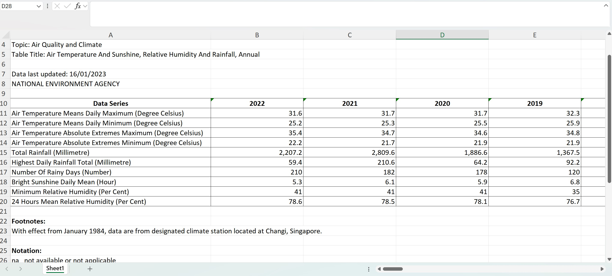
The annual temperature and rainfall data was first extracted from the given Excel file using the readxl library in R. This library allows the use of the range argument to specify the range of cells to read. 
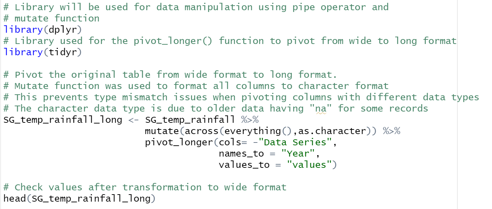
As the data was given in a wide format, the objective was to convert it to the long format before extracting the temperature time series required. While the wide format contains years as columns and individual series as rows, the long format would contain the years in a single column and the series values in another column.

After pivoting, the next step involves extracting the average daily maximum temperature series and the average daily minimum temperature series from the long table. This was done by using the filter() function to filter for the rows containing the series name. The column names were also changed to reflect the nature of the time series, and the final series was converted back to the numeric data type.
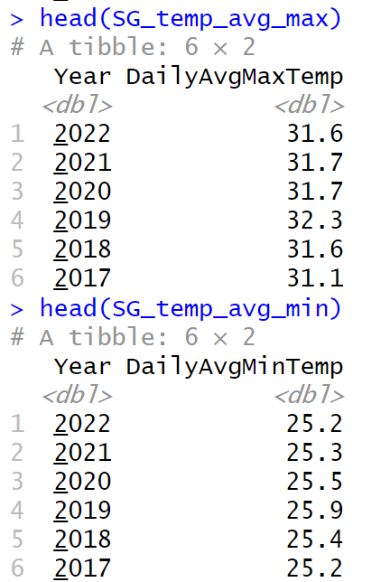
Both series were then sorted by the “Year” variable to reverse the sequence of the given time series datasets. This is required as time series datasets should be sorted chronologically from the oldest to the newest.
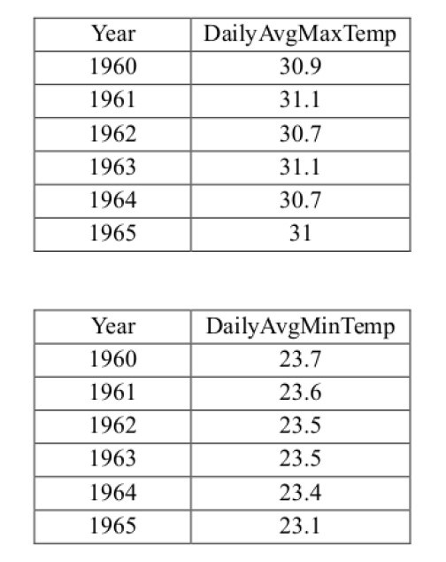
Sample of the time series data prepared is shown as above.

After the data preparation steps, a check was done to ensure no values were missing.

## Exploratory Data Analysis
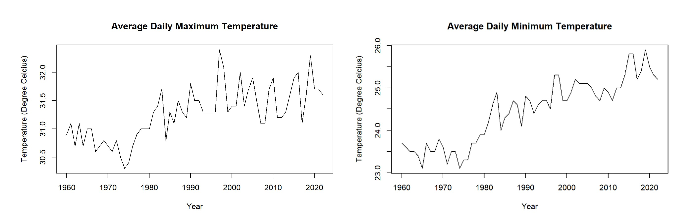
The line plots of both the average daily maximum and minimum temperature time series datasets were generated using the plot() function in R. In both plots, there appears to be an increasing trend in the temperature. To verify that this trend exists, a linear model of the form Temperature = β0 + β1*Year + ε was constructed for each of the two series.
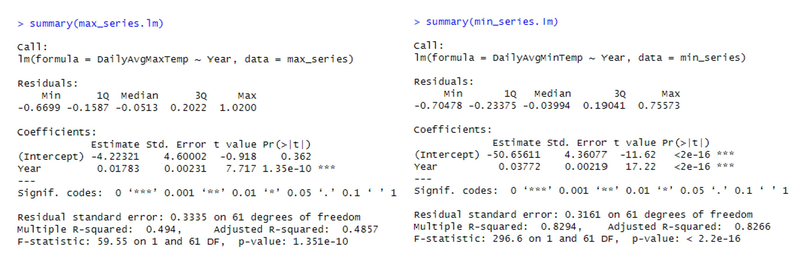
For both series, the coefficient of year was found to be statistically significant, with p-values below 0.05. Therefore, a trend exists for both series. The value of the coefficients was also positive, at 0.0178 for the average maximum temperature series and 0.0377 for the average minimum temperature series. This indicates that the trend is positive and the average maximum temperature and the average minimum temperature in Singapore increase, on average, 0.0178 and 0.0377 degrees per year respectively.

The R-squared values for the average minimum temperature series were also rather high at 0.829, which suggests that the year alone can explain 82.9% of the variation in average minimum temperature. However, after further examination with the Durbin-Watson test, the residuals of this linear model were found to be autocorrelated. This violates the assumption of independence of the residuals and disqualifies the linear model from being used for forecasting.
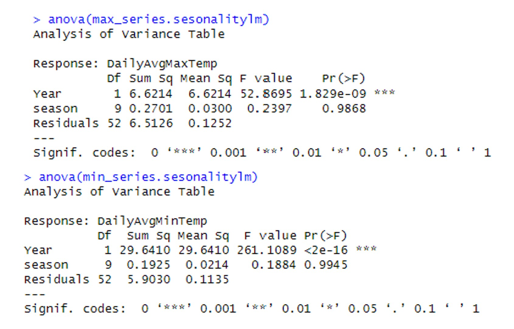
As a yearly series, there are no natural seasonal cycles to analyse the seasonality component. Using a linear model with 10-year seasons, ANOVA tests reveal that models with seasonality are no different from those without seasons (p-value of seasons is > 0.05). Hence, no reasonable seasonal cycles could be found for both the temperature series.
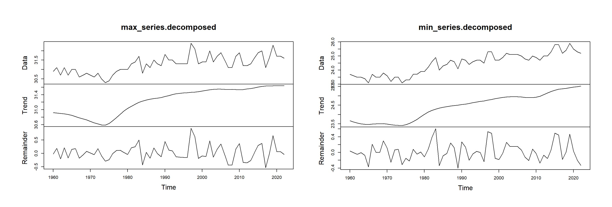
The decomposition plots were generated using the mstl() function rather than decompose(), as no seasonal cycles exist. This function performs STL decomposition (Hyndman & Athanasopoulos, 2018) which allows time series without seasonality to be decomposed. As seen previously, a positive trend can be observed in the trend component, which accounts for the majority of the magnitude of the time series.

The random component of the decomposition plots does not show any patterns, and the residuals are uniformly scattered about zero. Both plots also have near constant variance, as the magnitude of the residuals mostly fluctuates between -0.4 and 0.4. This confirms the validity of the decomposition.

## Forecasting Model Selection

From the decomposition plot and linear models above, it has been determined that both series have trends but no seasonality. Some suitable forecasting models for a series with these characteristics are the ARIMA models and the double exponential smoothing model.
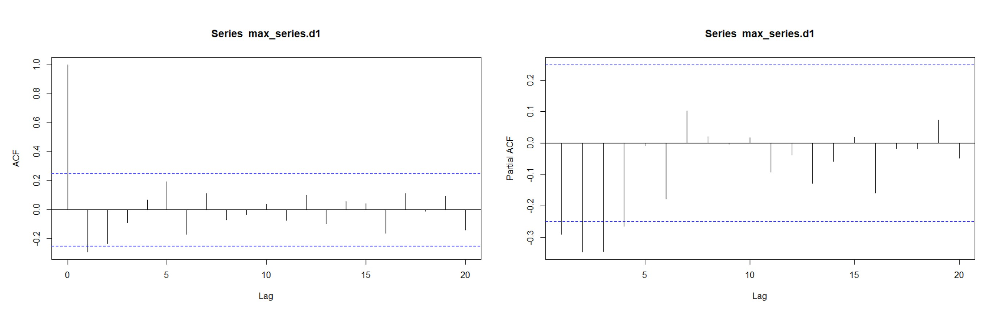
To determine the order of the ARIMA models to be used, ACF and PACF plots after differencing were generated. First-order differencing was required since the series has a trend and is therefore non-stationary. The ACF and PACF were both found to show exponential decay, which is characteristic of an ARMA(1) model. However, the ACF can also be interpreted as having a cutoff after lag 1. Hence, candidate models are ARIMA(1,1,1) and ARIMA(0,1,1).  
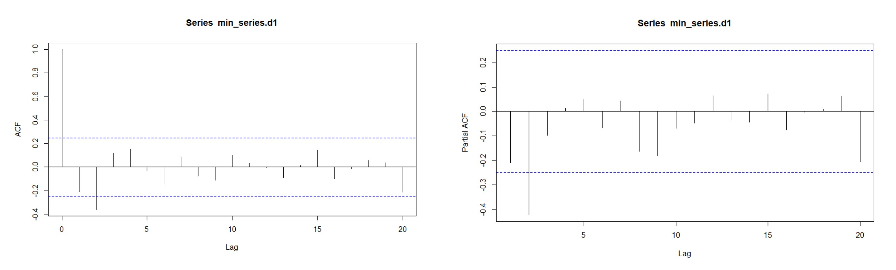
Similarly for the average minimum temperature series, differencing was conducted before plotting the ACF and PACF. In this case, the plots show a cutoff in the ACF after lag 2 and an exponential decay in the PACF, which hints at a MA(2) model. Thus, ARIMA(0,1,2) is a candidate model.

The proposed models for the average maximum temperature series were computed in R using the arima() function on the differenced series. ARIMA(0,1,1) and ARIMA(1,1,1) models both had statistically significant coefficients (p-value <0.05). However, coefficients of higher order models such as ARIMA(1,1,2) were not found to be statistically significant. 

The double exponential smoothing model (DESM)  was also fitted on the original temperature series to evaluate its potential use as a forecasting model. Akaike Information Criterion (AIC) and Mean Absolute Deviation (MAD) values for all three models were obtained and presented in the table below. 
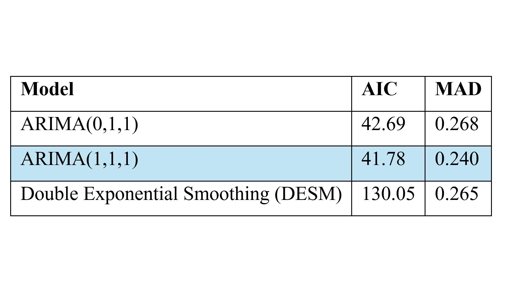
Analysis of the results shows that ARIMA(1,1,1) exhibits a lower AIC value and suggests that it has a better goodness of fit compared to ARIMA(0,1,1). Additionally, the model has a lower MAD, which supports its superior accuracy in capturing the patterns in the time series. While not directly comparable using the AIC, the MAD of DESM is worse than the ARIMA(1,1,1) model, which indicates poorer forecasting accuracy. Hence, ARIMA(1,1,1) was chosen as the champion model for the average maximum temperature series.
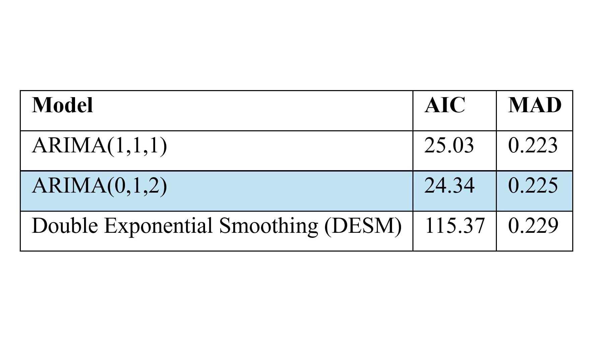
Repeating the same model fitting process for the average minimum temperature series in R, it was found that ARIMA(1,1,1) and ARIMA(0,1,2) models had statistically significant coefficients. Using the same evaluation criteria as before, ARIMA(0,1,2) was selected as the champion model for the average minimum temperature series due to its lower AIC, which indicates a better fit. Its MAD is also lower than DESM and comparable with the other model.

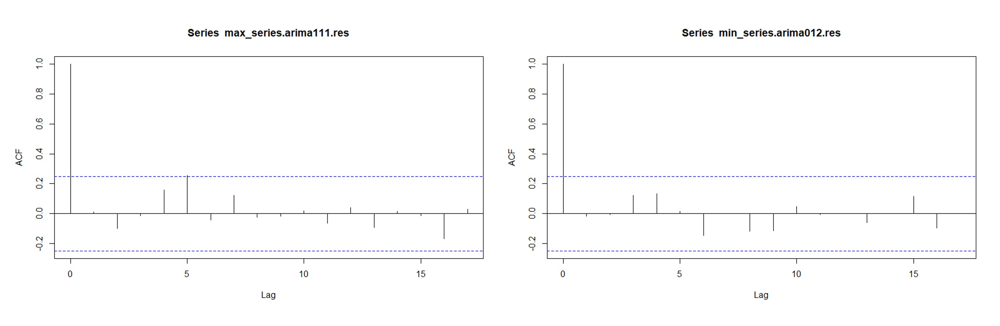
To further assess the validity of the chosen models, diagnostics were carried out for both time series. As seen above, no significant lags were observed. Therefore, there is no autocorrelation, and they are independent.
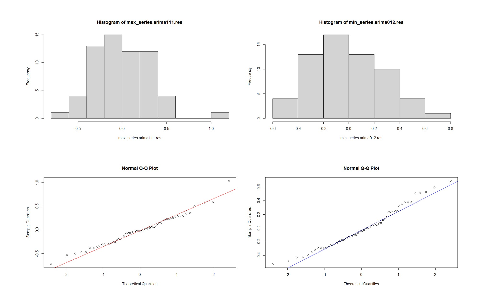
By inspecting the histograms visually, the residuals of both models are normally distributed apart from the outlier at the extreme right of the maximum temperature series. QQ plots also show most residuals lying close to the QQ line. 
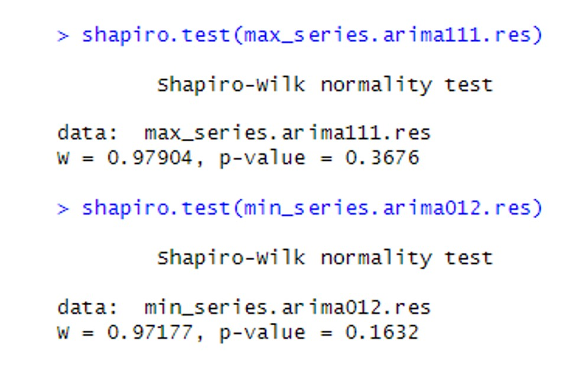
To confirm the results statistically, a Shapiro-Wilk normality test was performed. Both models had p-values greater than 0.05. Hence, we do not reject the null hypothesis that the residuals are normally distributed.
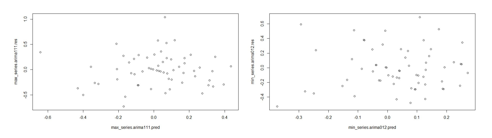
Lastly, the residuals were plotted with the predicted values to verify that they have a zero mean and constant variance. As seen from the figure above, the residuals are randomly distributed around zero with constant variance. The outlier from the maximum temperature series can also be observed.

## Forecasting Results and Discussion
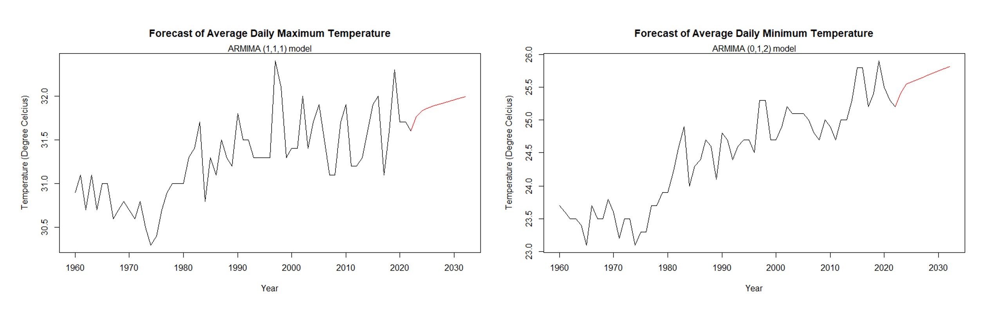
As both ARIMA models are valid, the next step was to calculate the forecast values by reversing the differencing and plotting the original series with the forecasted values. The forecasts both predict an increase in the average maximum and minimum temperature in Singapore over the next ten years. By 2032, the average temperature is forecasted to be between 25.8 °C and 32 °C. In the short-term future, this increase is greater, as illustrated by the steeper slope for the forecasts for the first few years.

While the forecasts provide insight into future temperature developments, the models may not be able to capture effects from external factors and mitigation efforts that could influence temperature trends. The historical increase in temperature was partly contributed by Singapore’s rapid urbanisation since the 1970s. This effect, known as the Urban Heat Island (UHI) effect, is caused by built-up urban environments and vehicles that trap heat and release the heat at night. Mitigation efforts by the Ministry of Sustainability and the Environment to reduce the UHI by using building materials that absorb less heat may slow the increase of average temperature in the future.

Other external factors include the El Niño phenomenon and the Indian Ocean Dipole. These irregular climate patterns typically lead to drier and warmer weather conditions in Singapore (CNA, 2023). According to Meteorological Service Singapore, the spike in temperature in 1997 was attributed to strong El Niño effects. This corresponds to the outlier identified in the residuals of earlier. 

Given that these external climate factors introduce uncertainty into Singapore’s temperature developments, relying solely on the forecasts in the short to medium term may not be ideal.

## Incorporating Rainfall Data
To attempt to improve the forecasting results, the use of the total rainfall time series as an additional predictor variable was investigated. Data was prepared in a similar way to the temperature series earlier.
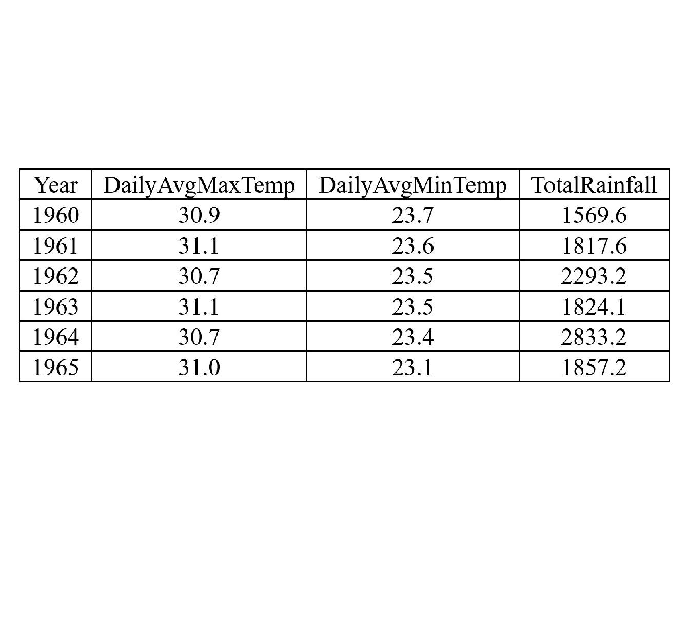
The rainfall data time series was then plotted visually to explore the changes in total rainfall over time.From the plot, the series does not show an obvious trend in any direction. 
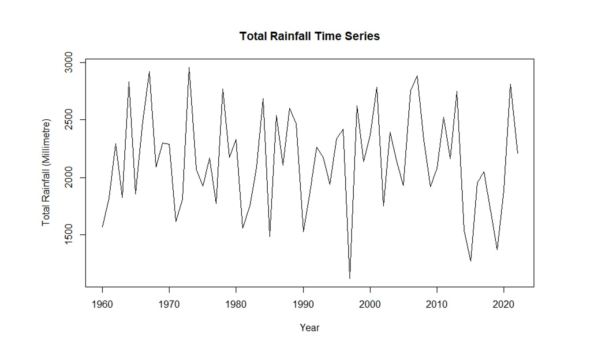

## Prewhitening the Series
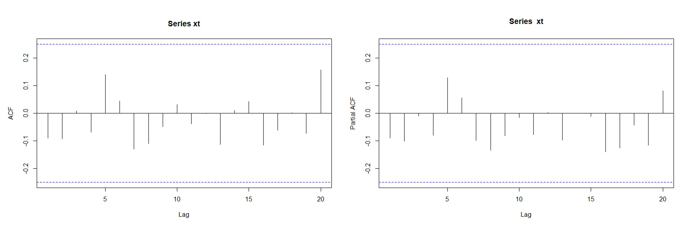
The differenced rainfall series was denoted as xt and prewhitened using an ARIMA model. The model was chosen by referencing the ACF and PACF (above). Since the ACF and PACF of total rainfall show no significant lags, ARIMA(0,0,0) was chosen.

After fitting the model for xt, the residuals of the model were taken as the prewhitened series for xt (alphat). Following this, the same model fitted for xt was fitted on the average daily maximum temperature series (yt) and average daily minimum temperature series (yt2) without optimisation. The residuals of the model fitted on yt and yt2 were then saved as betat for each series separately. Calculation of the cross-correlation function (CCF) with the residuals of xt and yt2 after model fitting shows that lag 2 of the xt series was statistically significant.
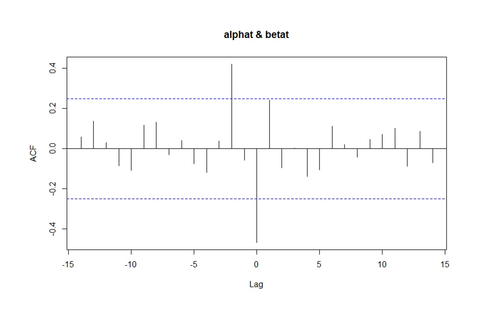
## Determining Significant lags of xt (Rainfall series)
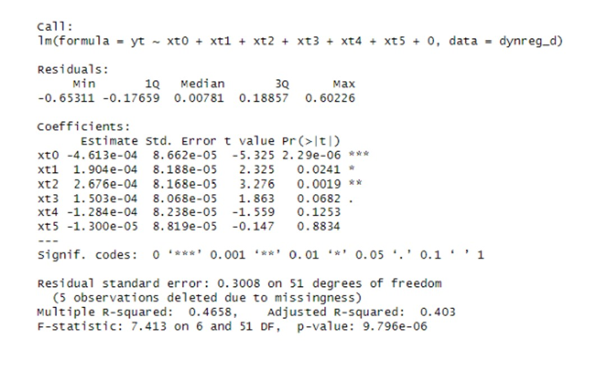
To determine which of the lags of xt should be included in the ARIMAX model, a linear model with lags 0 to lag 5 of xt was created. Backwards stepwise selection was performed to eliminate the least significant variables from the model one at a time, until only statistically significant variables remain. 
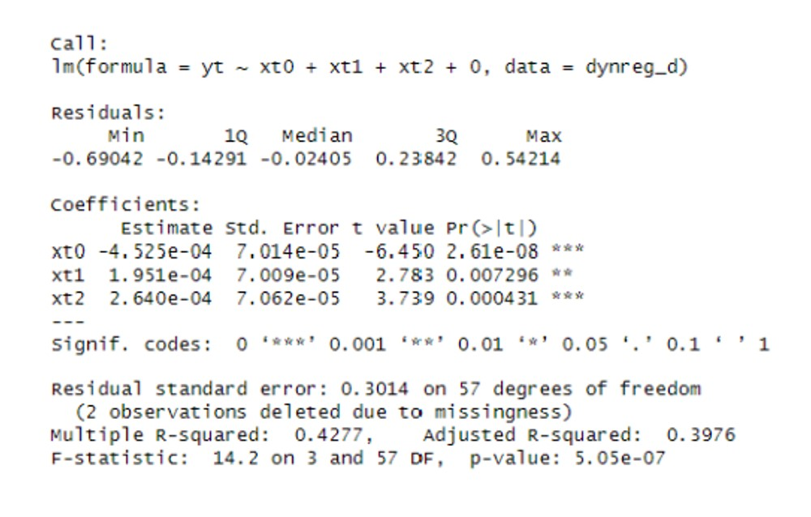
Only the original xt and its lags 1 and 2 remain in the final model. 
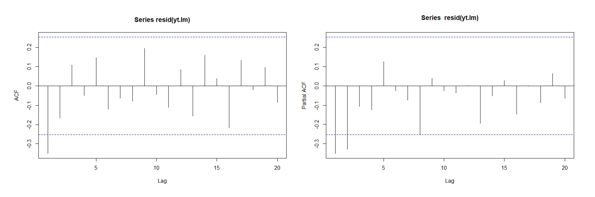
The order of the ARIMAX model to fit would depend on what information is left over in the residuals of the linear model. By examining the ACF and PACF of the residuals of the linear model, it was determined that a MA(1) model was required for the residuals of yt after fitting the linear model due to a cutoff in the ACF at lag 1 and an exponential decay in the PACF.

Backwards stepwise selection was also performed for yt2, with xt itself and its lag 2 remaining in the final linear model. The ACF and PACF of the residuals for the linear model fitted on yt2 both appear to show a cutoff at lag 2. This suggests an ARMA(2,2) model may be appropriate.

## Forecasting with ARIMAX models
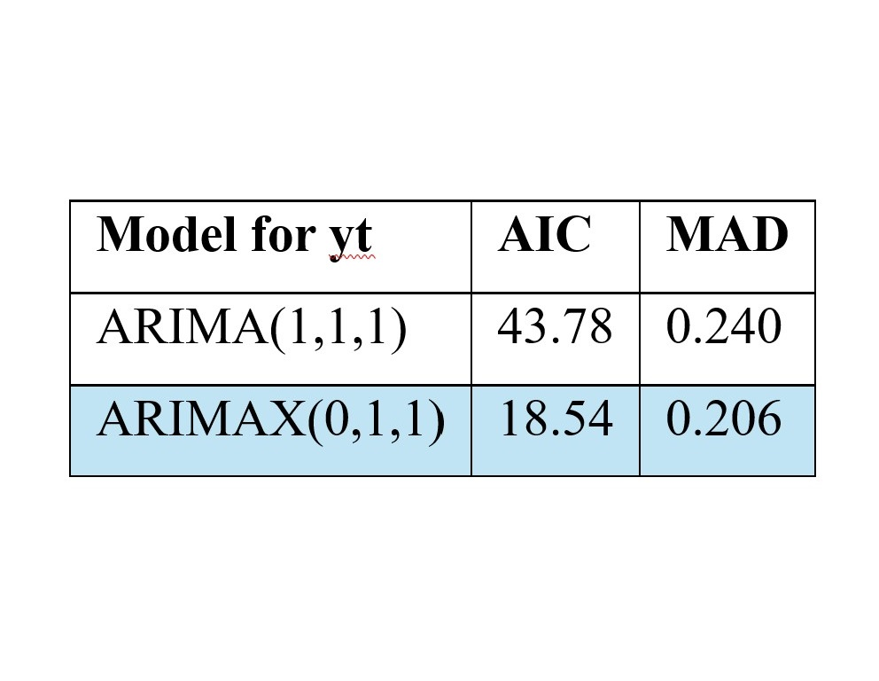
The accuracy and goodness of fit of the ARIMAX model were found to be superior to the ARIMA(1,1,1) champion model chosen previously. This is evident from the much lower AIC and lower MAD values of the ARIMAX model compared to ARIMA(1,1,1).  Based on these metrics , the additional predictor (total rainfall and its lags) has improved the quality of the forecasting model and should be selected as the new champion model for forecasting the average daily maximum temperature.
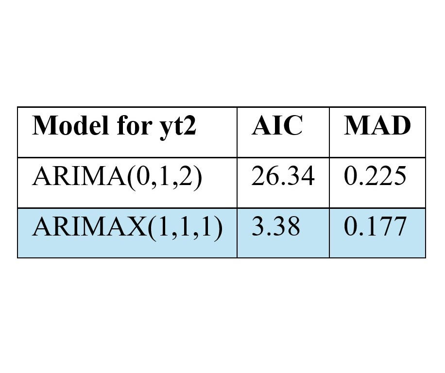
Similarly, the ARIMAX(1,1,1) model for the yt2 series also largely outperforms the ARIMA(0,1,2) model previously, with its much lower AIC and MAD values. Hence, the new model can also be adopted as the champion model based on the evaluation criteria.
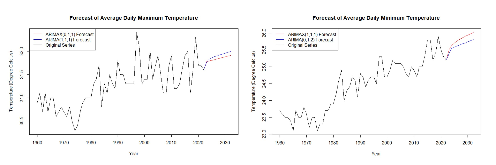
The new forecasts predict a similar increase in the average daily maximum temperature in the near future, followed by a slower increase in the longer term. On the other hand, the ARIMAX model predicts a faster increase in minimum temperature compared to the ARIMA model for both the near and longer term future.

The lower MAD of ARIMAX models suggests that the forecasts will be more accurate. For short term temperature developments one year later, rainfall and its lags could help to improve the accuracy as there is actual lagged data available to support the forecasts. However, for long term predictions, such as 10 years later, ARIMAX may be less reliable as it is relying on forecasted rainfall values. These long-term forecasts have the same value for multiple years since rainfall is essentially a white noise time series (ARIMA(0,0,0)). Unless future rainfall can be predicted accurately by other methods, the ARIMAX models could introduce additional uncertainties in the longer-term forecasts for temperature.

## Conclusion
- Singapore's average temperatures have been steadily increasing, with a statistically significant upward trend.
- In this project, both ARIMA  and ARIMAX models identified a continued increase in temperature over the next decade.
- Including an additional predictor variable such as rainfall may improve short-term temperature forecasts but may lose accuracy in the long term due to lack of actual data for lagged rainfall values.
- External factors and mitigation efforts can influence future temperature trends, highlighting the need for further research.

External Links: 
[link:View R Code](https://waijie-portfolio.streamlit.app/Forecasting-Temperatures-In-Singapore)

##### The full version of this project was submitted as part of an assessment during the course ANL557 : Applied Forecasting.

