In this project, my team and I were tasked with extracting insights from an e-commerce coupon site dataset using any of the SAS tools taught during the SAS AIML program, such as SAS Data Studio and SAS Model Studio in SAS VIYA.

## Business Understanding
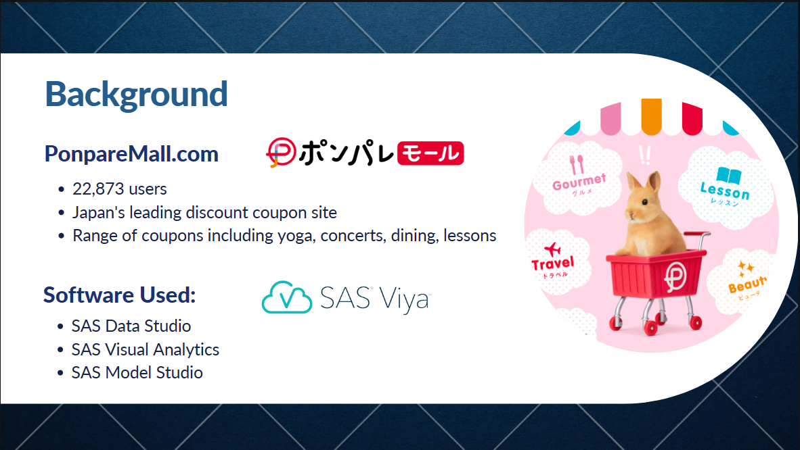
The Ponpare site is a coupon site that sells discount coupons for a wide variety of products in Japan. Users purchase discount coupons, which can be exchanged for goods and services at the discounted prices. The objective of the project was to gather insight into the customer demographics and their spending habits so as to create a recommendation system to promote the right coupons to interested customers.

## Data Understanding
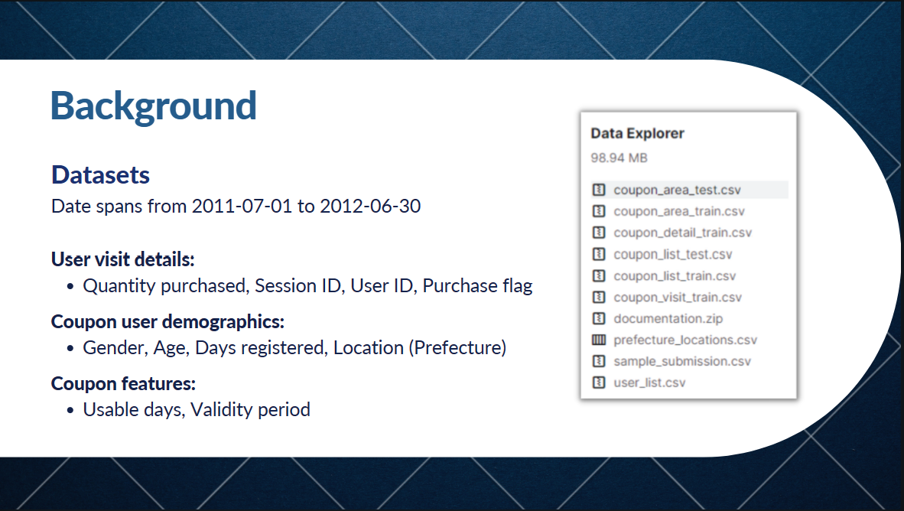
The full dataset contains various categories of data involving details of e-commerce user visits, demographics of the coupon users, as well as features or properties of the coupons sold. This dataset was obtained from Kaggle.

## Data Preparation
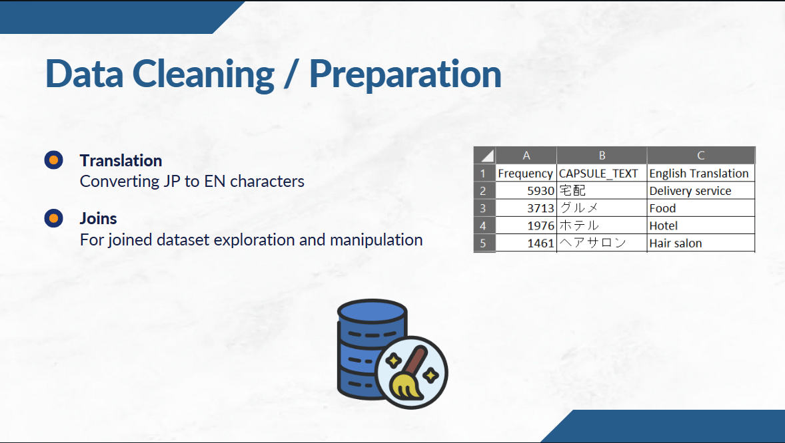
Several steps of data preparation were required before the data could be used, as many of the characters were in Japanese and the dataset was not given in a suitable format for analysis. This was translated with the help of Google Translate to create lookup tables for the Japanese characters.
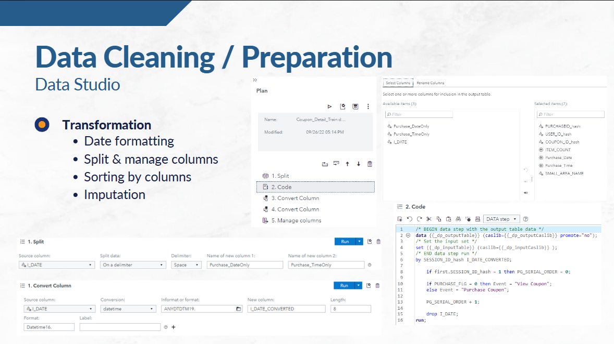
The data preparation steps were done in SAS using the Data Studio. This provides a visual interface to manipulate data in SAS VIYA. For more complex data transformations, we used user written SAS code to transform the data as seen above.

## Data Visualisation
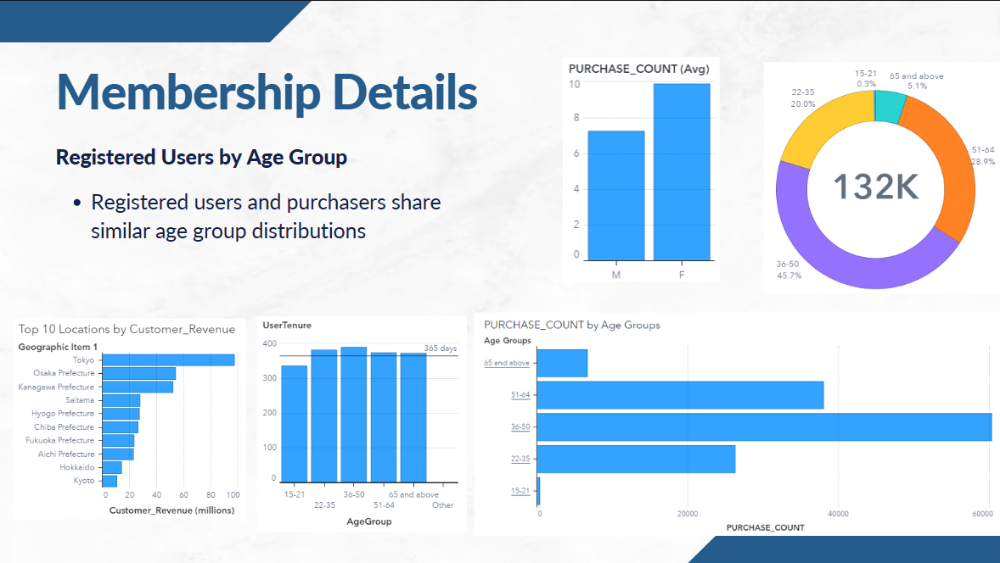
Key facts obtained from data visualisation were:
- The largest number of users were from Tokyo.
- The users between 36-50 years old were likely to purchase more.
- Female users on average purchased more coupons than male users.
- Most of the users have already registered before the beginning period of the dataset as seen in the UserTenure.
- very little users from 15-21 were using the site (0.3% of user base)
- Overall, the customer profile of the site's users are those aged 36-50 years old
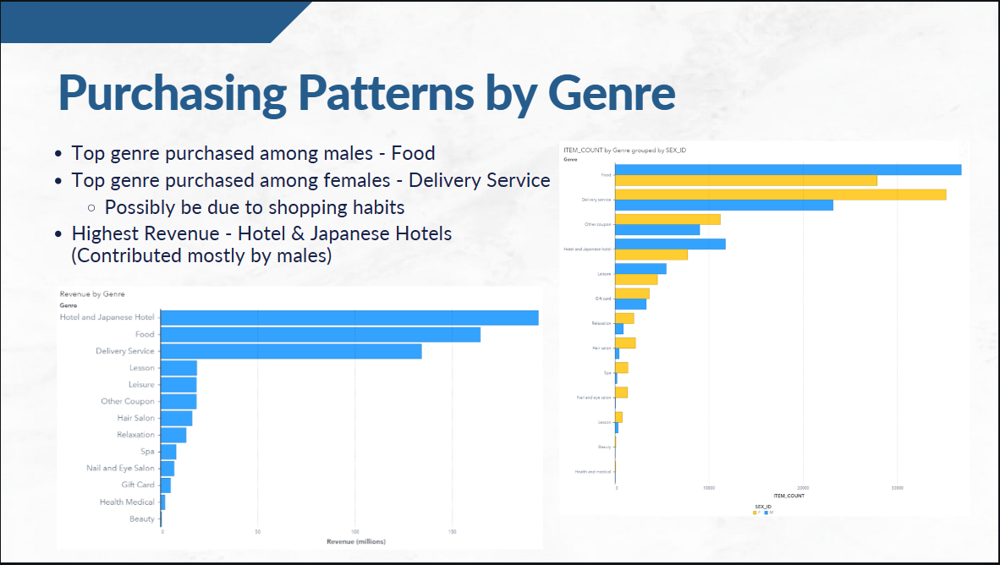
The purchase habits of customers for different genres of coupons also proved to be interesting. Males tend to purchase the most food coupons, while females purchased the most delivery service coupons. However, when analysing by revenue, the hotel category generated the most revenue for the site, despite the food and delivery coupons selling in larger numbers.
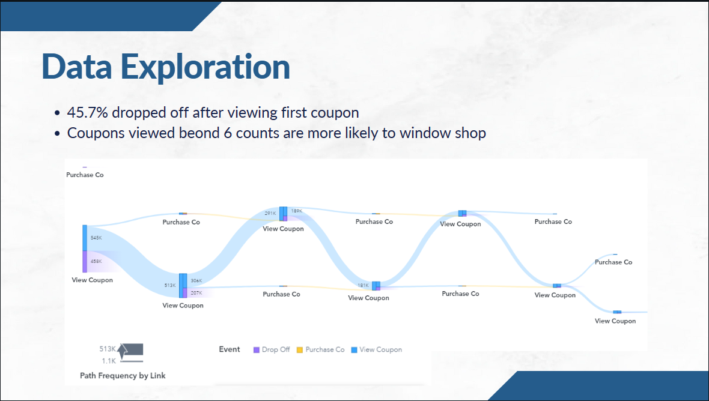
Surprisingly, the order in which the customer viewed the coupon also affected how likely they would purchase a coupon. From the path plot, when the customer has viewed 6 or more coupons, the likelyhood a purchase was made fell significantly to almost zero. This can be seen from the increasingly narrow path in yellow, which represents those who made a purchase.

## Modeling
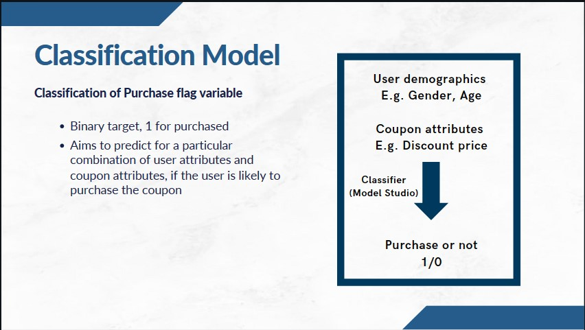
To further dive into the reasons behind the trends observed, a binary classification model was created to predict whether a customer is likely to purchase a coupon.
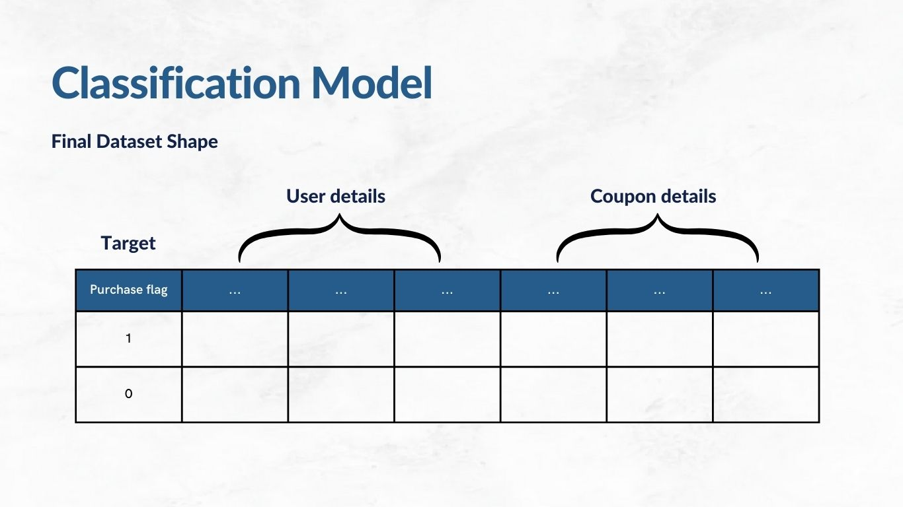
Data was then prepared with SAS Data Studio to shape the available data into the correct format for the classification model.
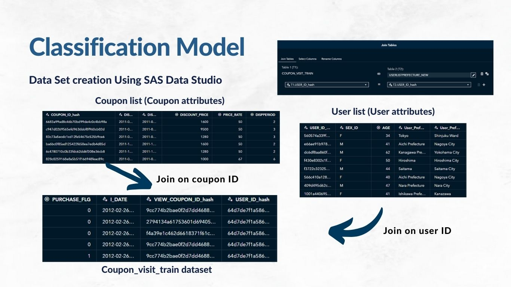
The features considered consist of user demographics (age group, gender, etc.), location, as well as attributes of the coupon such as the category and discount rates.
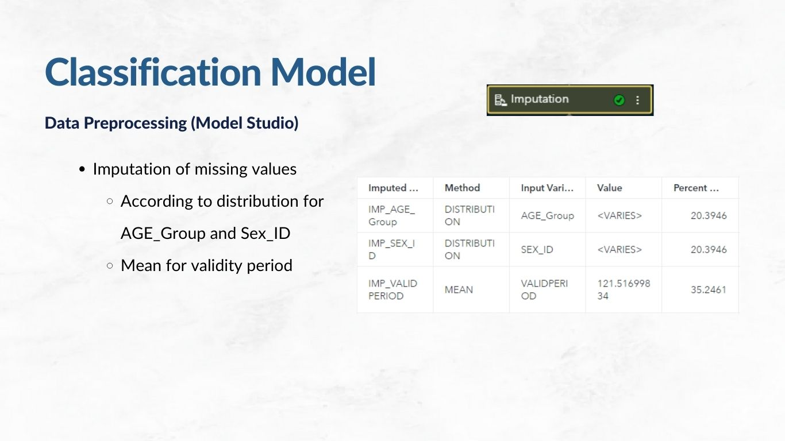
Further data preparation for machine learning was also performed on the dataset using SAS Model Studio in SAS Viya. These include imputation of missing values and transforming/scaling highly skewed variables.
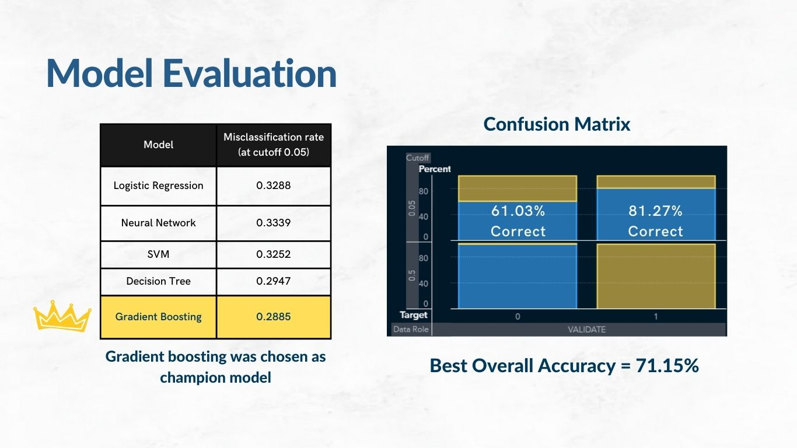
Finally, a series of candidate models were evaluated to find the best model that predicts if a customer is likely to buy the coupon given its characteristics. The gradient boosting model was chosen as the champion model due to its higher accuracy and good precision in detecting the true positives.
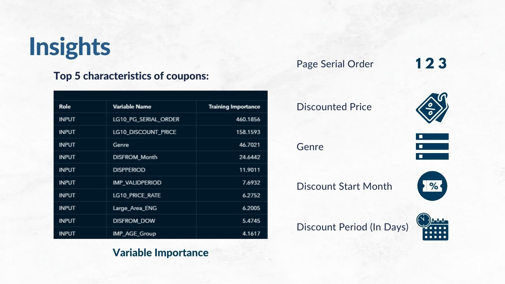
The top 5 most important characteristics of the coupons were the serial order (order in which the customer sees the coupon), discounted price, genre, month in which the discount starts, and the period the discount is valid for. This aligns with the previous analysis that the viewing order of the coupon affects how likely someone is to purchase the coupon.

## Potential Applications and Deployment
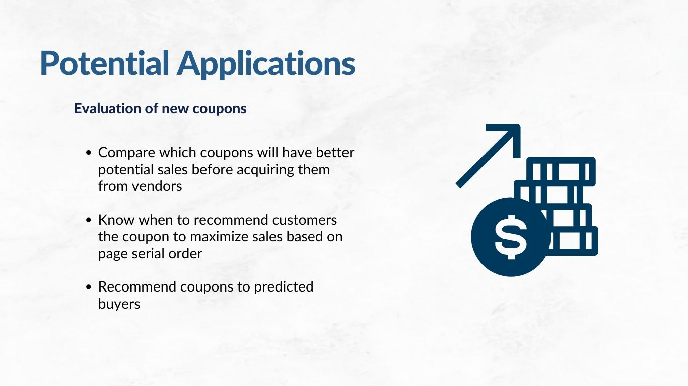
Potential applications of the model would be a recommendation system to recommend coupons to potential customers that are likely to buy.

The model also suggests the option to monetise the right for sellers to push up the viewing priority of their coupons, as coupons shown to customers first are more likely to be purchased.

External Links: 
[link:Canva - Full project slides](https://www.canva.com/design/DAGFU9OLjMg/QNT-C4ZXk77vYVJgEr7nWQ/view?utm_content=DAGFU9OLjMg&utm_campaign=designshare&utm_medium=link&utm_source=viewer)

##### The full version of this project was presented during the SAS AIML Program Final Project.