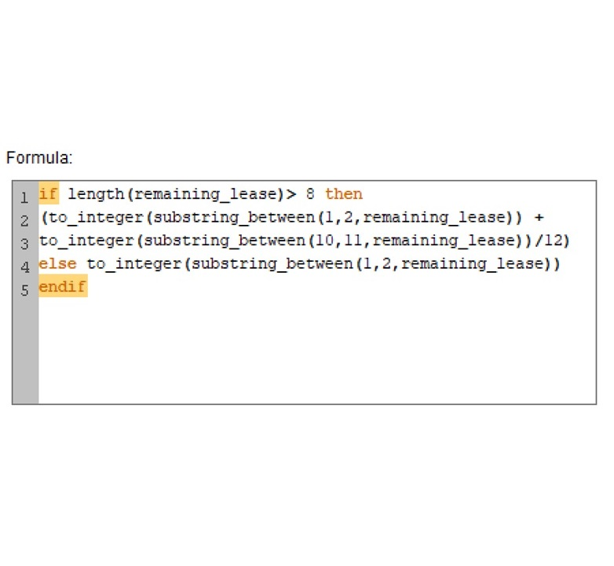
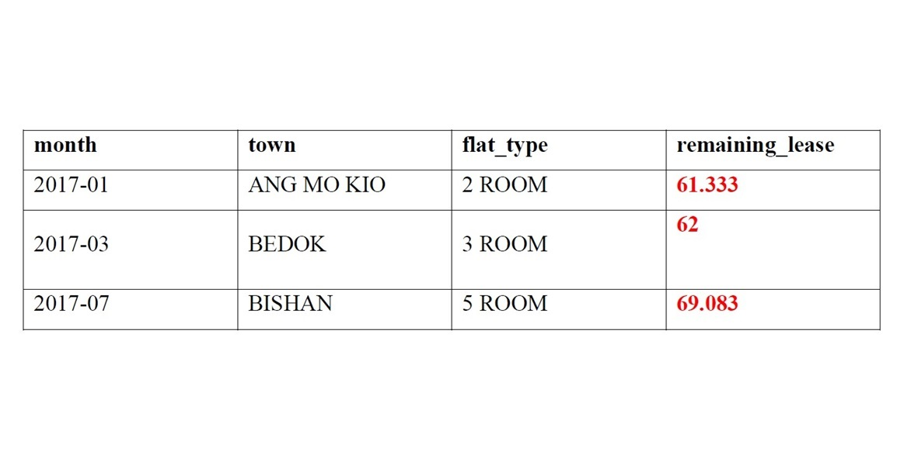
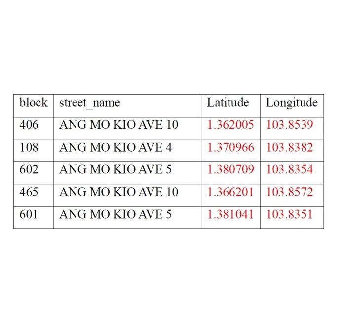
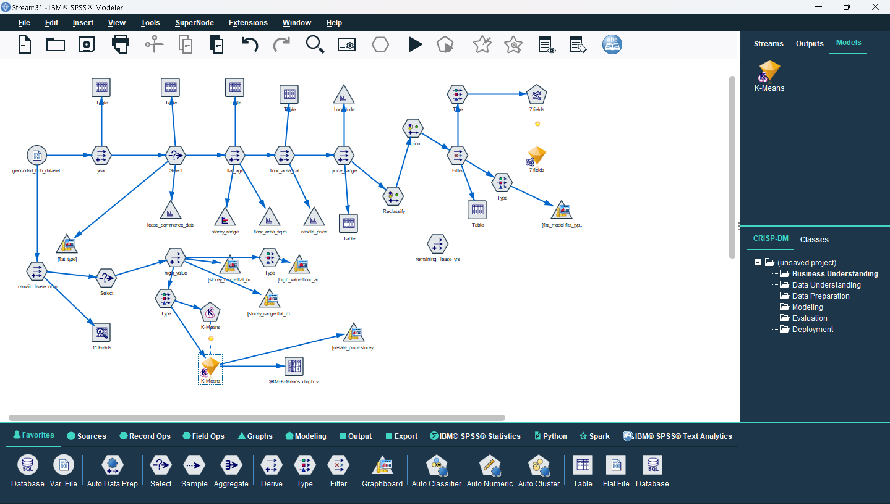
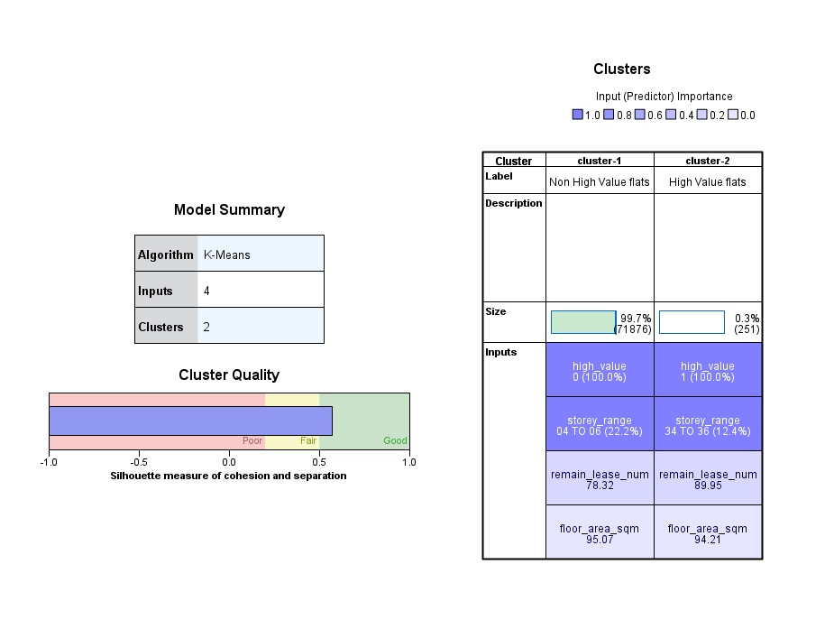
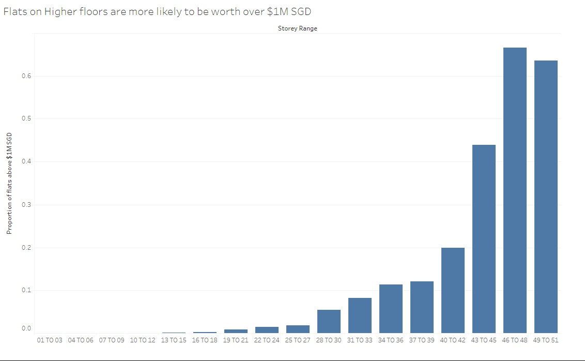
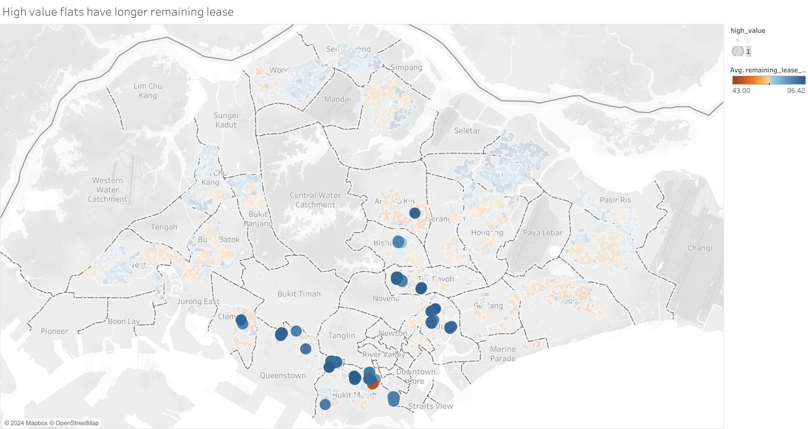
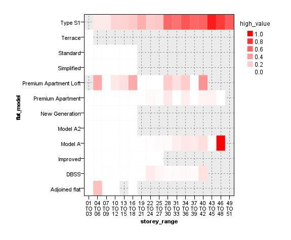

This project aims to analyse the resale values of HDB flats in Singapore, specifically focussing on 4-room flats, to identify characteristics that contribute to high resale values exceeding $1 million. Using the K-means clustering technique, a dataset of over 170,000 HDB resale transactions from 2017 to January 2024 was analysed to identify key factors that influence resale prices. The insights gained from this project can empower prospective buyers to make informed decisions when purchasing a 4-room HDB flat. The project is presented using the CRISP-DM methodology.

## Business Understanding

In recent years, a growing trend has emerged in Singapore's housing market: 4-room HDB flats are increasingly selling for over $1 million. This phenomenon raises a crucial question for potential buyers: what factors contribute to these high resale values?

The primary objective is to empower prospective buyers by identifying key characteristics that contribute to high resale values exceeding $1 million in 4-room HDB flats. By analysing the data, we aim to provide buyers with a clear understanding of the factors that influence resale prices and help them make informed purchasing decisions.

## Data Understanding

The data source is the HDB Resale Flat Prices dataset available on Data.gov.sg, containing over 170,000 records from 2017 to January 2024. Each record represents a resale transaction with various attributes, including:

- Location: town, block number, street name, latitude, and longitude.
- Flat Type: Categorised by size, e.g., 3 ROOM, 4 ROOM.
- Model: Specific design and layout of the flat, e.g., Model A, Type S1.
- Construction Date: Lease commencement date indicating the year the flat was built.
- Lease Remaining: Remaining years and months of the lease period.
- Resale Price: The price at which the flat was sold in the transaction.

Data quality issues and derived variables:

- Lease Remaining: Originally in text format (e.g., 61 years 04 months), requiring conversion to a numeric format for analysis.
- Resale Price: A new flag variable "high_value" was derived to categorise flats above $1 million (1) and below (0).

## Data Preparation

- Formatting of Remaining Lease: The text format of "remaining_lease" was converted to a numeric value in years by extracting year and month values.
- Creation of High Value Flag: A new "high_value" column was created based on the "resale_price" to categorise flats above or below $1 million.
- Geocoding: Using the OneMap search API, latitude and longitude coordinates were obtained for each HDB block. For example, the coordinates for the first five addresses are given below.

- Filtering: The dataset was filtered to include only 4-room flats, aligning with the project's focus.

##  Modeling and Visualisation

The K means clustering model was chosen as this can help to identify the natural groupings of HDB flats in the data. Two clusters were chosen to attempt to cluster the data points into two distinct groups of high value and lower value flats.

Clustering allows us to examine features that contributed to the formation of each cluster. From the model above, cluster 1 contains flats with resale values below $1 million. These flats are generally on the lower floors and have a shorter average remaining lease of 78.32 years. Cluster 2 contains the flats with high resale values. These flats are on the higher floors and have a longer average remaining lease of 89.95 years.

Using visualisation techniques, more detailed analysis of each variable can subsequently be performed. Bar charts can be used to compare values from each cluster. For example, the figure above confirms that a large proportion of high storey range flats are of high value.

As the coordinates of HDB flats are available, maps can also be used to observe the geographical distribution of high-value HDB flats. Continuous variables such as remaining lease can also be plotted as colours to indicate their magnitude. In the figure above, most high value flats are coloured blue, which represents a longer remaining lease. Less surprisingly, these flats can be seen concentrated near the central region of Singapore.

Lastly, heat maps can be used to present key results. The proportion of high value flats for each pair of variables can be quickly observed with the red rectangles. The figure shows that a large proportion of flats of model “Type S1” on higher storeys are considered high value. Some “Model A” flats are also valuable if they are located on higher floors.

## Evaluation

From our model, flats on higher floors and with longer remaining leases are more likely to be valued above $1 million. Cluster 2 contains all flats exceeding a million dollars, and this demonstrates that the model can group the flats accurately. This model meets the objective as it was able to identify characteristics such as the remaining lease and the storey range that affect the resale value. Further analysis using visualisation techniques also reveals additional findings where flats in the central area and of model “Type S1” are more likely to be high value flats.

## Deployment
The insights and visualisations derived from this project will be presented to prospective buyers as a guide to help them make informed decisions. This data-driven approach empowers buyers to:

Identify desirable features: Focus on flats with higher floors, longer remaining leases, central locations, and "Type S1" models.
Negotiate effectively: Leverage their knowledge of key factors to negotiate better prices for desirable flats.
Maximise their investment: Make informed decisions based on data, increasing their chances of finding a high-value property.

## Conclusion
This project successfully identified key factors influencing the high resale value of 4-room HDB flats. By utilising the K-means clustering technique and employing visualisation techniques, the project provides valuable insights that can empower buyers or sellers to make informed decisions regarding their property transactions.

##### The full version of this project was submitted as part of an assessment during the course ANL551: Data Analytics for Decision Makers.
