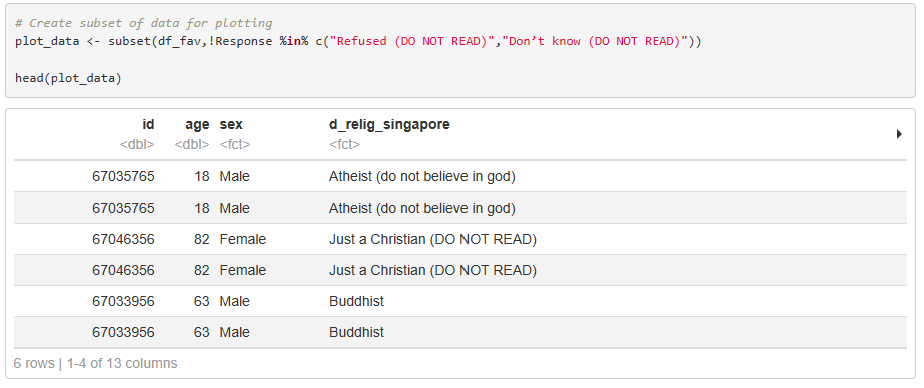
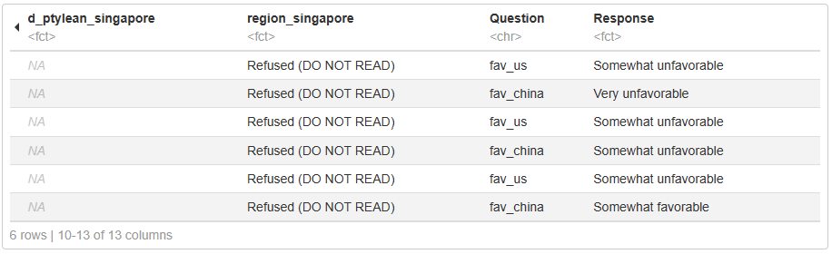
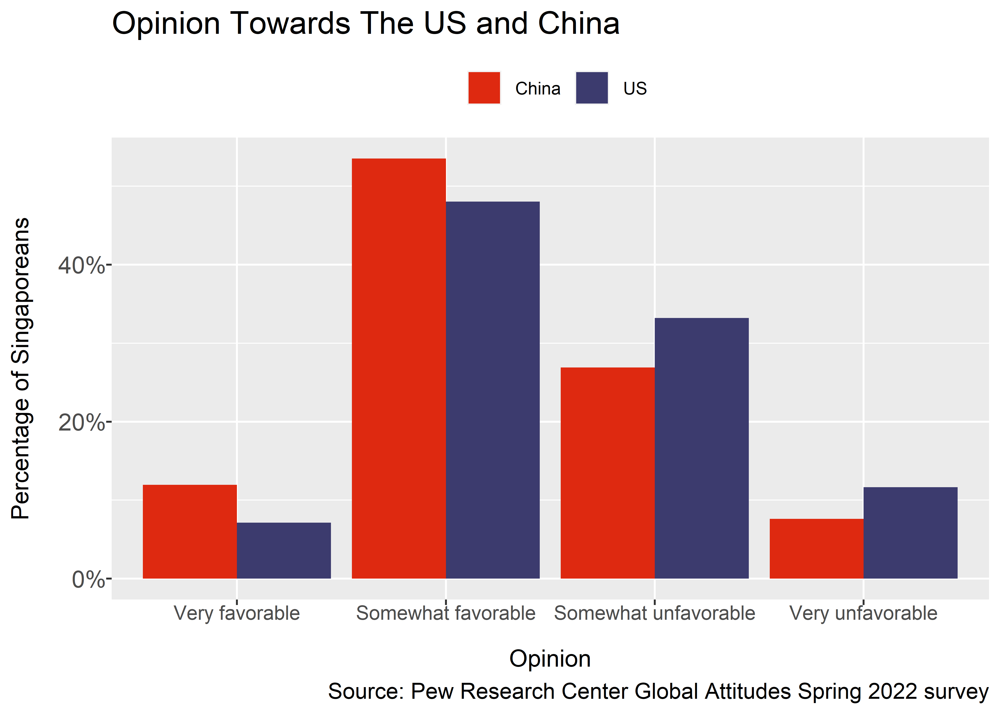
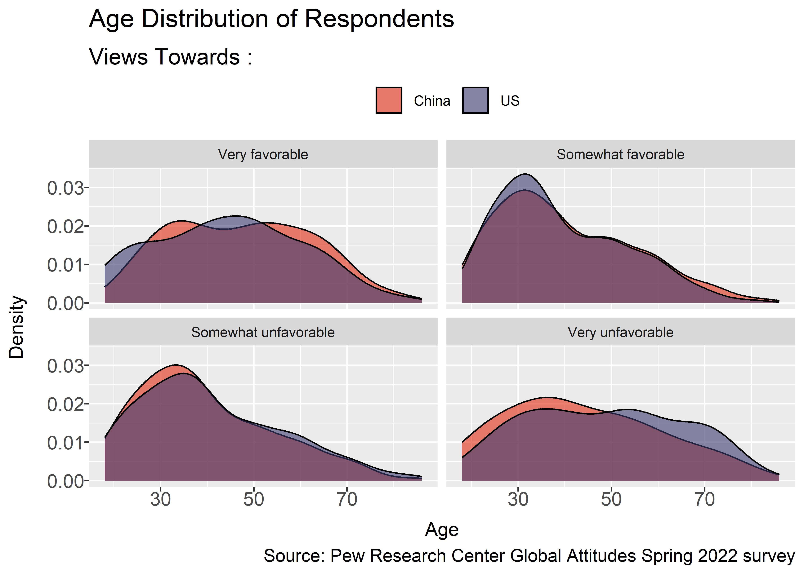
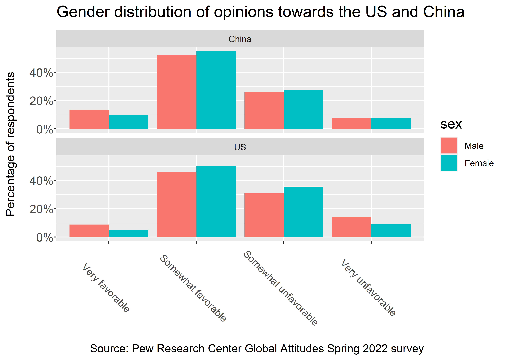
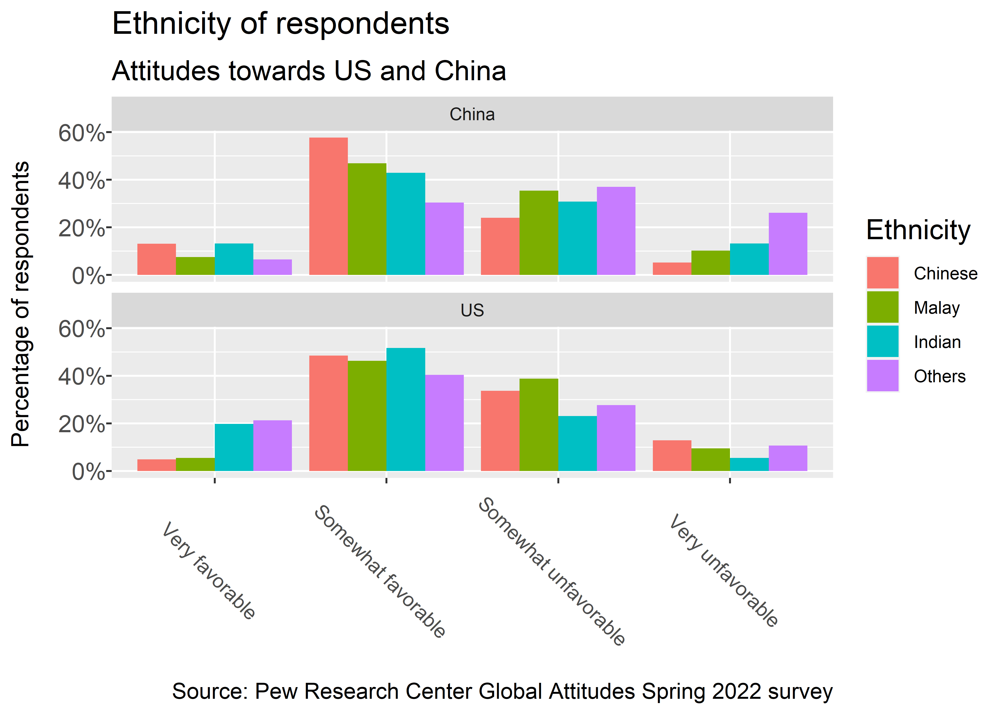
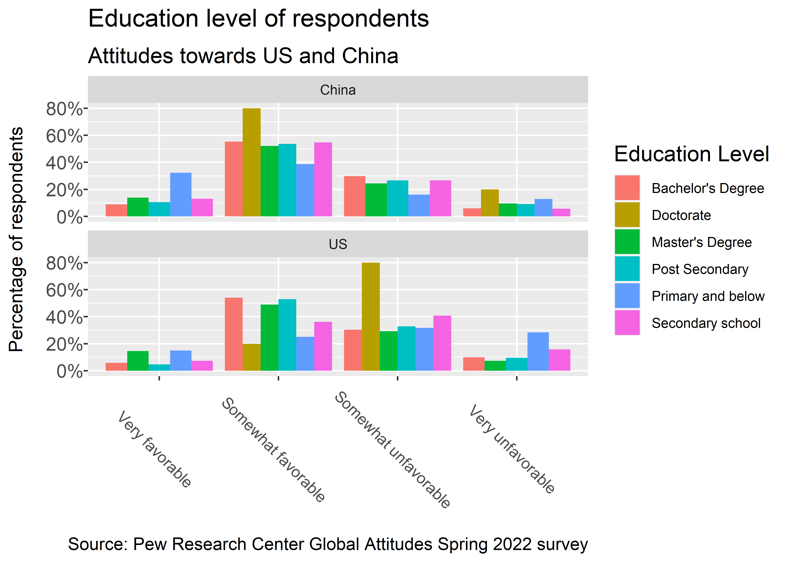

This project analyses data from the Global Attitudes Spring 2022 survey conducted by Pew Research Center, focussing on Singaporean opinions about the US and China using R and ggplot. The objective was to present the insights through data visualisation.

## Data Preparation
To analyse the attitudes of Singaporeans towards both the US and China, data from the Global Attitudes Spring 2022 survey conducted by Pew Research Center was loaded into R using the foreign package. The data was then filtered to only include responses from Singaporeans. By consulting the questionnaire documentation, the columns “fav_us” and “fav_china” were found to be the main subjects of this analysis. Additionally, demographic information such as the age, gender, and various columns relating to the education level, ethnicity, and income level of respondents were also retrieved and saved into a new dataframe.

To prepare the data for plotting, the columns related to survey questions were pivoted into a single column, while those that contained demographic information were left alone. This was to ensure that the responses for similar questions are contained in a single column and can be plotted on the same chart. The dataframe was then filtered to only contain survey questions related to how favourable each respondent was towards both countries of interest.

Sample of the dataset after pivoting the raw data: 

Following that, a quick examination of data types discovered that age was classified as a factor instead of numeric. Age was converted into numeric in two steps as shown below to remove the character values and prevent unusal values from being created. The rest of the categorical variables can be left as factors with no issues. 

With that, the data can now be plotted to determine the opinions of Singaporeans towards both the US and China. The plot_data dataframe was created to remove response values marked as “DO NOT READ” as these are not valid responses. 

Subsequently, other plots were also produced from the same original dataframe and recategorisation of variables was done only for the education level variable. 

## Attitudes of Singaporeans towards the US and China

In the Global Attitudes Spring 2022 survey, 1001 Singaporeans were asked about their opinion towards China and the US. Interestingly, the percentage of respondents from Singapore who indicated that they have a favourable view of China surpassed those who have a favourable view of the US. More than 11% of respondents who answered the survey had a very favourable opinion of China and over 53% of them had a somewhat favourable opinion of China. Their opinion towards the US was lower at 7% and 47% for very favourable and somewhat favourable, respectively. More than 10% of respondents also had a very unfavourable view of the US compared to less than 10% for China. Although the majority views both the US and China somewhat favourably, it seems like some Singaporeans are now viewing the US less favourably compared to China.

To delve into the reasons behind these choices, this report will first look into the demographics of the survey respondents and how this may have affected their views on the US and China. Several factors, including age, gender, ethnicity, level of education, and income range, will be examined.
The survey was answered by a diverse age group ranging from 18 year old youths to the elderly in their eighties. The age group of respondents who had a very favourable view of China shows a bimodal distribution whereby those in their thirties and fifties were more likely to be found selecting very favourable when asked about their opinion on China.

Younger respondents in their thirties were more likely to be found giving a milder response of somewhat favourable and somewhat unfavourable compared to older peers, as seen from the left skewed distributions. When it comes to having stronger opinions towards both the US and China, a higher proportion of men compared to women choose the two extremes when answering the survey.

In terms of ethnicity, almost 60% of those who identify as ethnically Chinese have a somewhat favourable view of China. Although this was due to their shared heritage, almost 50% of the Chinese respondents also had a somewhat favourable view of the US. The proportion of Chinese and Indian Singaporeans who had a very favourable view of China was also very similar.

On the other hand, those who did not identify as Chinese, Malay or Indian had a much higher proportion of very unfavourable responses when asked about China compared to the other races. This is in contrast to their much higher proportion, indicating that they have a very favourable view of the US. Overall, some respondents do lean towards countries that share the same heritage as themselves, but the majority do not favour one country over the other.

The education level of the respondents may be another factor that impacts the worldview of the respondents. Over 30% of those who responded very favourably towards China had an education level of primary school and below. This is similar to the proportion of individuals with primary or lower education who had a very unfavourable view of the US. Individuals who were more highly educated mostly chose to view both the US and China somewhat favourably, as seen from the bars representing bachelor’s degrees and master’s Degree being close to the 50% mark. The only exception was that doctorate holders viewed China more favourably compared to the US.

## Conclusion
Ultimately, it can be seen from the survey results that the majority of Singaporeans still hold a somewhat favourable view of both the US and China. The balance of power between the two is instrumental to the stability of the region, and major shifts in sentiment would have dire consequences. However, there is a minority group of Singaporeans who have a very favourable view of China and a very unfavourable view towards the US. These individuals are mostly men in their fifties who do not have much formal education and come from a mix of ethnicities. 

External Links: 
[link:View Python Code](https://waijie-portfolio.streamlit.app/Visualising-Singaporean-Attitudes-towards-the-US-and-China)

##### The full version of this project was submitted as part of an assessment during the course ANL501: Data Visualisation and Storytelling.
