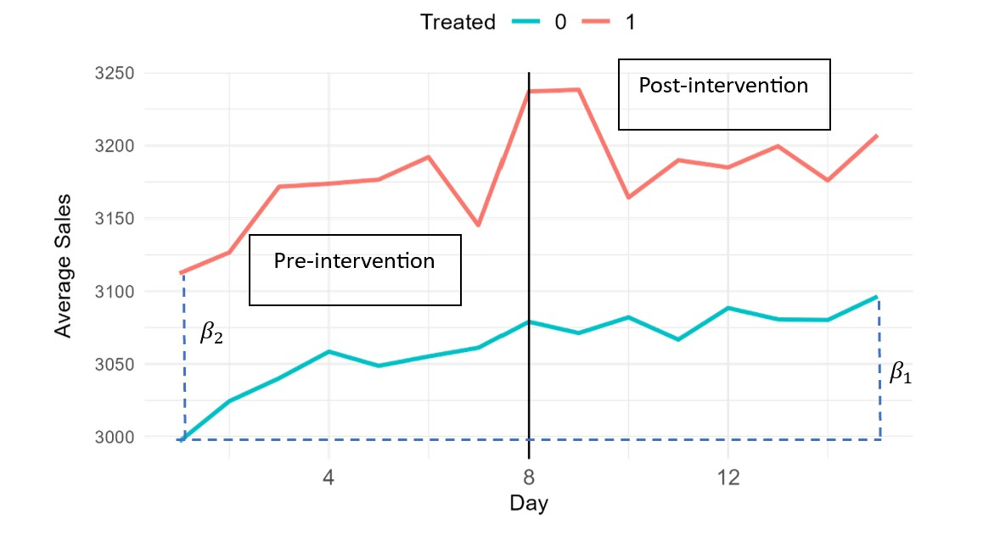
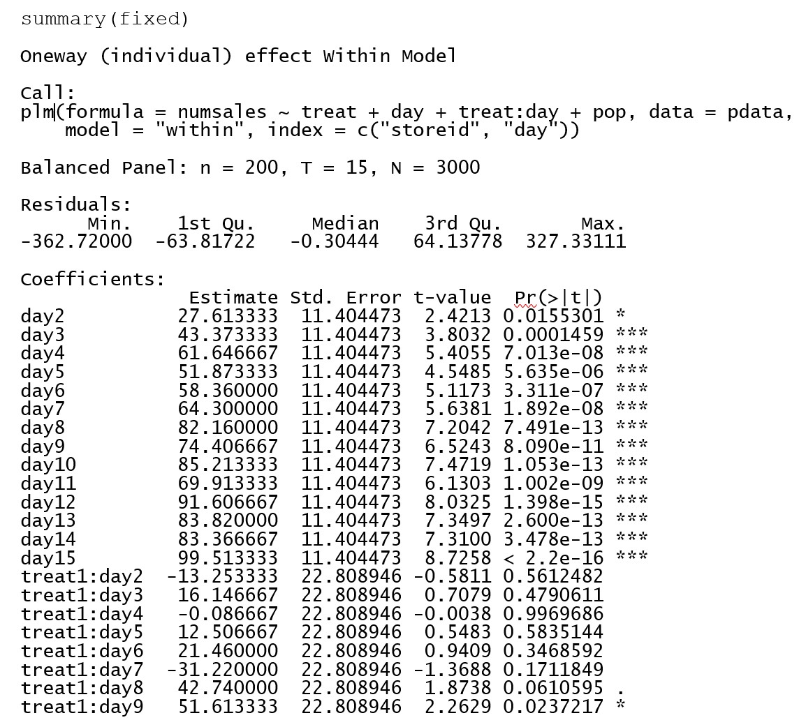
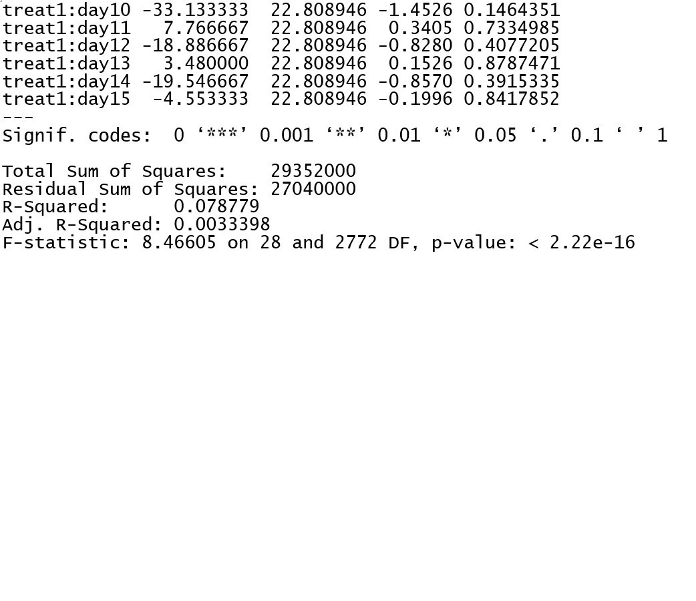
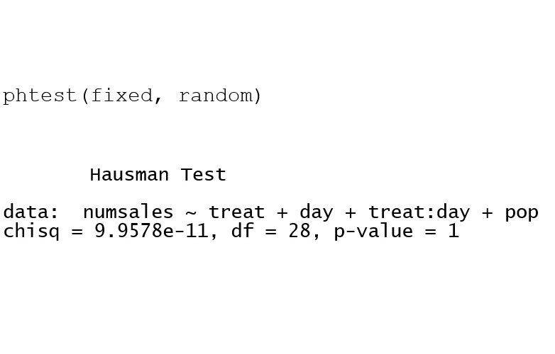

This project utilizes a Difference-in-Differences (DID) approach to evaluate the impact of a 10% discount on dairy product sales at 200 supermarkets of a certain chain over a 15-day period. The analysis distinguishes between supermarkets receiving the discount (storeids 1-50) and those not receiving it (storeids 51-200). Initial observations indicate higher average sales in the discounted group. By comparing sales trends before and after the discount implementation between the treated and control groups, the DID methodology isolates the effect of the discount from other factors. Results suggest that the discount significantly increases dairy product sales, with parallel trends in sales patterns supporting the validity of the DID approach.

## Introduction
To investigate the effect of a 10% discount on dairy product sales, a Difference-in-Differences (DID) model was utilized. This model leverages the parallel trends assumption, which posits that the trends in the outcome variable (sales) for the treated and control groups would have been parallel in the absence of treatment. The analysis covers a pre-treatment period (days 1 to 7) and a post-treatment period (days 8 to 15).

## Model Specification

Two-Period DID Model:
The basic DID model can be expressed as:

𝑌=𝛽0 + 𝛽1Time + 𝛽2Treat + 𝛽3(Time×Treat) 

- 𝛽1: Captures the time effect on sales for the control group.
- 𝛽2: Represents the pre-treatment differences between the control and treated groups.
- 𝛽3: Represents the treatment effect (i.e., the impact of the discount on sales).

Multi-Period DID Model: 
To capture more complex patterns, a multi-period DID model was applied:

𝑌=𝛽0 + 𝛽1Time2 + 𝛽2Treat + 𝛽3(Time2×Treat) + 𝛽4Time3 + 𝛽5(Time3×Treat) + …

This model includes interaction terms between the treatment variable and each time period dummy variable, allowing for variations in the treatment effect over time.

Fixed Effects and Random Effects Models:

To account for unobserved heterogeneity, both fixed effects and random effects models were considered. The fixed effects model adjusts for entity-specific characteristics, while the random effects model assumes these characteristics are normally distributed.

Fixed Effects Model:
𝑌=𝛽0+𝛽1Time2+𝛽2Treat+𝛽3(Time2×Treat)+⋯+𝛽𝑛(Time𝑥×Treat)+𝑈+pop

Random Effects Model:
𝑌=𝛽0+𝛽1Time2+𝛽2Treat+𝛽3(Time2×Treat)+⋯+𝛽𝑛(Time𝑥×Treat)+pop+U

Where 𝑈 denotes entity-specific effects, and pop is the population variable around each supermarket.

## Results
Fixed Effects Model Results:

Pre-Treatment Period: The interaction terms between treatment and days 2 to 7 were not statistically significant, supporting the parallel trends assumption.

Post-Treatment Period: Significant interaction effects were observed on day 9, with a p-value < 0.05, indicating a substantial impact of the discount. The coefficient for the interaction term on day 9 was 51.6, suggesting that the discount led to an increase in sales by 51.6 units on this day.
Random Effects Model Results:

The random effects model produced similar results to the fixed effects model.
The treatment effect was significant on day 9, consistent with the fixed effects findings.
The population variable was not statistically significant, indicating it does not influence sales in this context.

Hausman Test:

The Hausman test showed that the random effects model is an acceptable simplification of the fixed effects model (p-value > 0.05).

## Conclusion
The DID analysis with both fixed and random effects models demonstrates that the 10% discount had a significant impact on dairy product sales, particularly evident from day 9 onwards. The parallel trends assumption was validated for the pre-treatment period. The population variable did not significantly affect sales and can be excluded from the model. Both fixed and random effects models are appropriate, with the random effects model being a simpler alternative.

The increase in sales due to the discount was quantified as 51.6 units on day 9, highlighting the effectiveness of the promotional strategy.