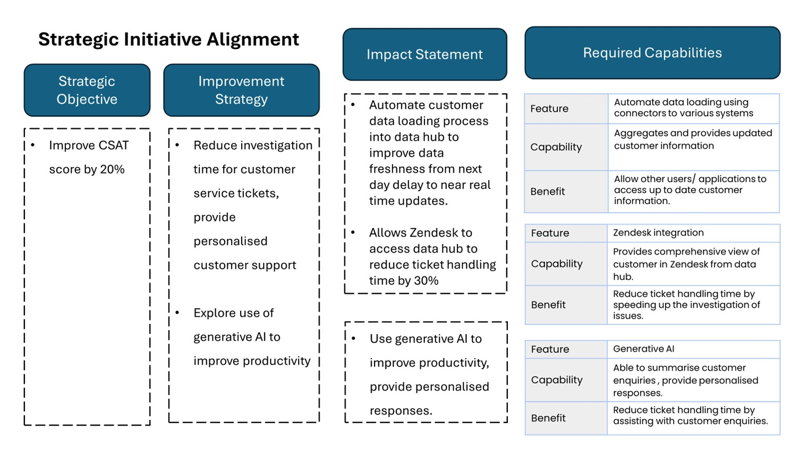
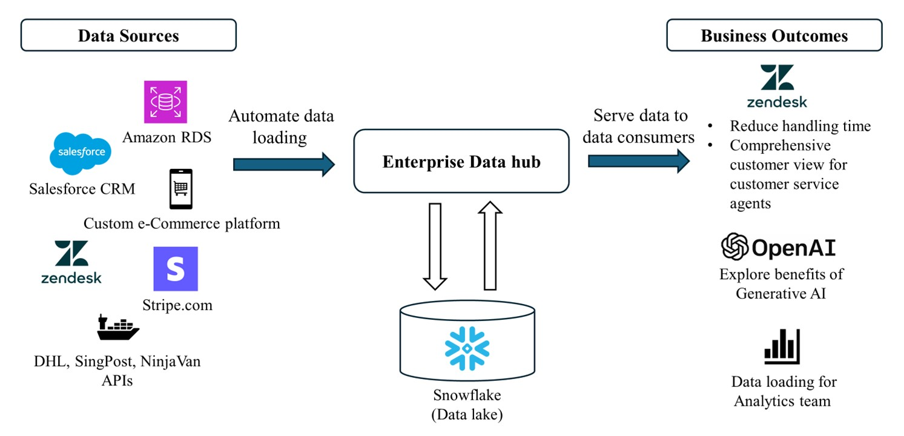
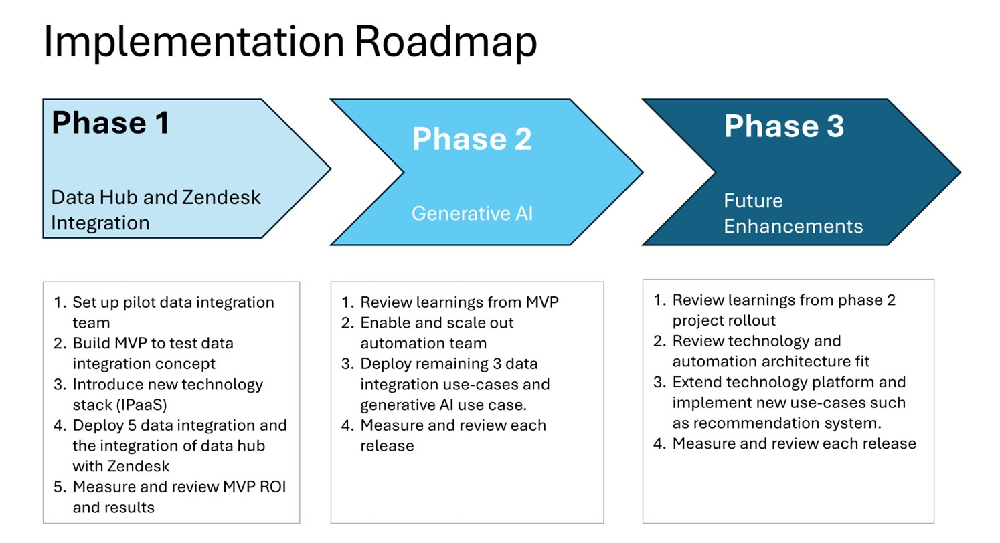
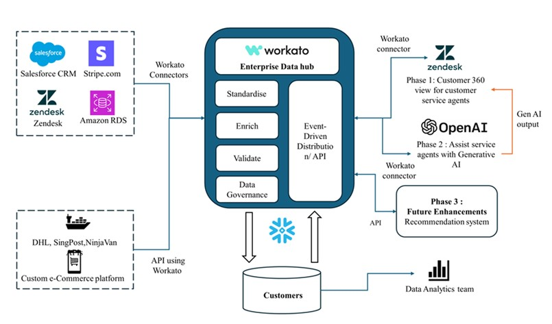
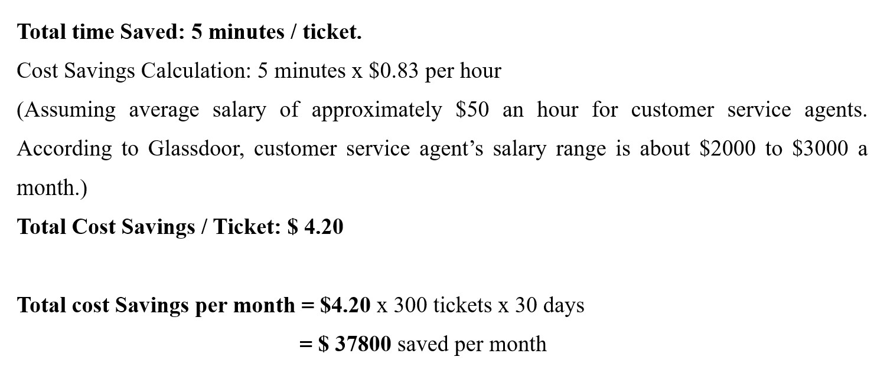

This project presents a comprehensive initiative aimed at enhancing customer satisfaction within CosmicCart through the development of a Customer 360 data hub. The project addresses the existing challenges in customer service resulting from fragmented data sources, proposing an integrated solution that streamlines access to customer histories. By automating data loading into a Snowflake data lake and incorporating generative AI assistance for service agents, the project seeks to improve service efficiency, reduce ticket resolution times, and ultimately elevate customer satisfaction (CSAT) scores.

###### Note: This project is fictional and created for educational purposes.

## Problem Statement

CosmicCart has seen a drop in customer satisfaction (CSAT) scores due to slow ticket handling times and incomplete information provided by service agents. This is caused by isolated systems, requiring agents to access multiple applications and manually updated customer data. To resolve these issues, an enterprise data hub is proposed.

## Proposed Solution

The data hub will integrate isolated data sources into a single, consolidated data lake, providing a "Customer 360" view. This unified data will empower service agents with better insights through Zendesk, improving ticket handling times and personalized responses. The hub also enables the use of generative AI for further productivity enhancements, potentially improving CSAT scores.

In addition to resolving the immediate CSAT concerns, the hub will automate data loading processes and open the door to future use cases like AI-driven customer interactions and product recommendations. It will also support collaboration with other teams, such as marketing, requiring access to customer data.

Implementing this solution is essential to improving CSAT and preparing for future growth.

## Project scope and deliverables 
The project is mainly broken up into two phases, with a third phase reserved for further enhancements after the conclusion of phase two. In the first phase,  the focus will be on creating  an MVP to integrate each unique type of customer data into a customer data hub. In the case of the shipping data use cases, NinjaVan will be selected as the candidate for the first phase of integration. Product data from the e-commerce store will be in phase two as it is least involved in the customer data hub. 

The following is the outline of the project: 
•	Data extraction from data sources (Salesforce CRM, e-commerce platform, Amazon RDS database, Zendesk, Stripe and NinjaVan APIs). 
•	Data processing, standardisation, validation, and enrichment of customer data from data sources will be performed before loading them into the data lake. This is to ensure data quality and consistency of data from various sources. 
•	Automated Data Loading: The project will utilize Snowflake as a data lake to automate the integration of customer data. This will ensure that service agents have access to real-time customer information, thereby enhancing their ability to serve customers effectively.
•	Distribution of data from Customer 360 data hub to data consumers (Zendesk, Generative AI use cases).

•	Generative AI Assistance: The incorporation of generative AI technology will assist service agents in real-time during customer interactions. This support is anticipated to streamline the ticket resolution process, equipping agents with the necessary tools to address customer inquiries more efficiently.

## Expected Outcomes

The implementation of the Customer 360 data hub is expected to yield several significant outcomes:

Reduction in Ticket Resolution Times: Immediate access to comprehensive customer histories is anticipated to result in decreased timeframes for resolving customer issues.

Enhanced Service Efficiency: A holistic understanding of customer interactions will enable agents to respond to inquiries more effectively, thereby improving overall service quality.

Improvement in Customer Satisfaction (CSAT) Scores: The ultimate objective is to enhance CSAT scores by fostering a sense of understanding and value among customers throughout their interactions with CosmicCart.

## Key measure of success
The current average ticket resolution time through Zendesk chat interface is 10 minutes, with an average of 300 tickets received per day.  This is slower than the average ticket resolution time of 324 seconds for the retail sector (CX Stats in 2023: Average Ticket Volume, Time to Resolution & Others, n.d.). 
The key measurement of success will be as follows: 

Unit of Measure:
●	Reduction in average ticket resolution time.
Measured Through:
●	Average time taken from ticket raised to ticket being resolved in Zendesk.
Cost Saving / Unit
Assuming an average of 5 min reduction in ticket resolution time: 

This is the potential benefit by implementing the data hub, Zendesk integration and generative AI to reduce average handling time by 50% and providing customer service agents with a full view of the customer. This value may continue to grow as the business grows and the number of tickets increases. 

##### The full version of this project was submitted as part of an assessment during the course ANL555 : Data Integration for Enterprise Automation

