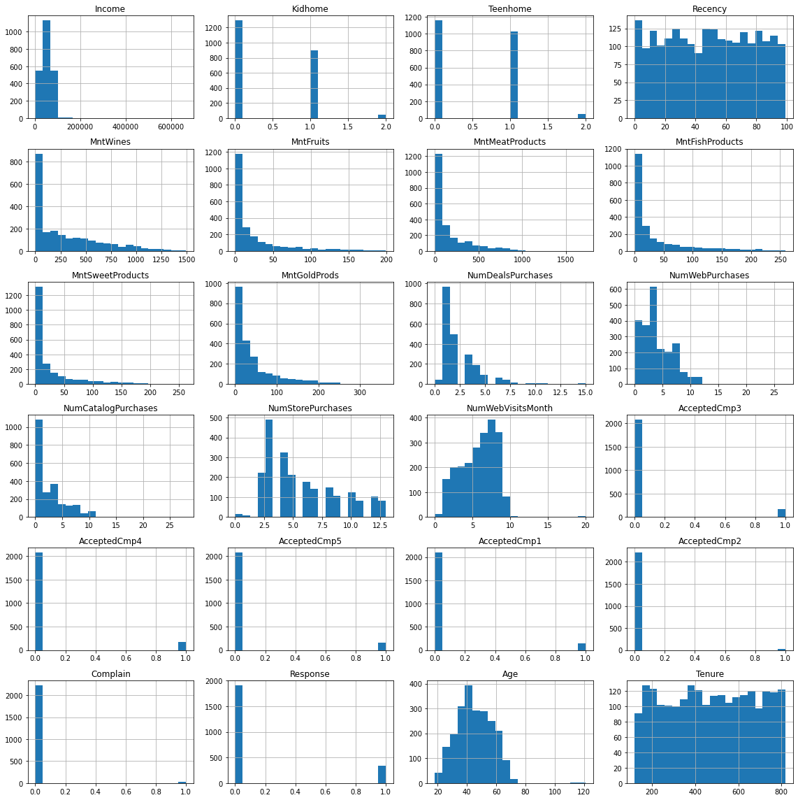
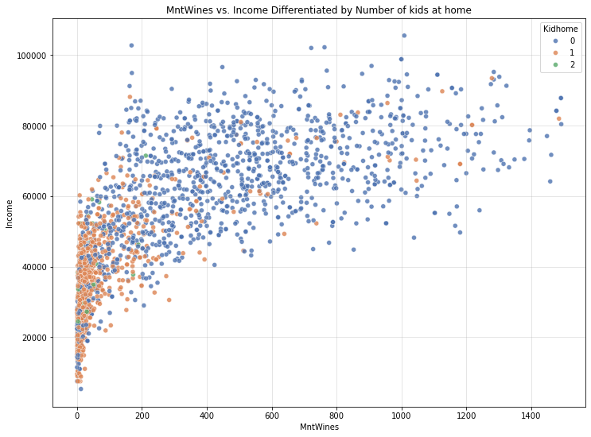
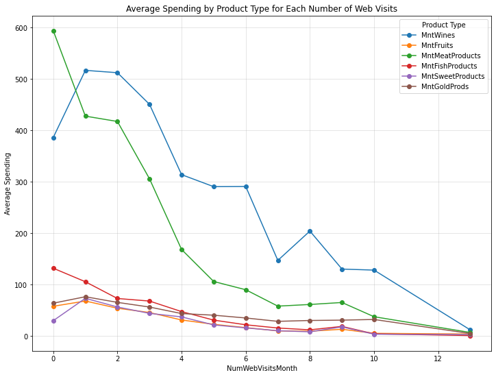
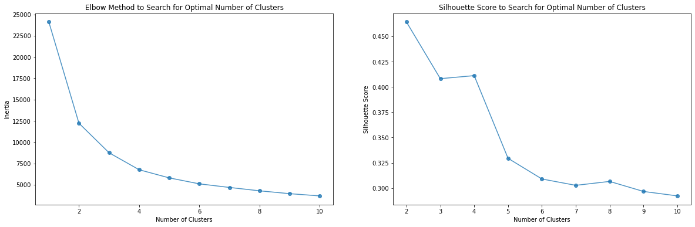
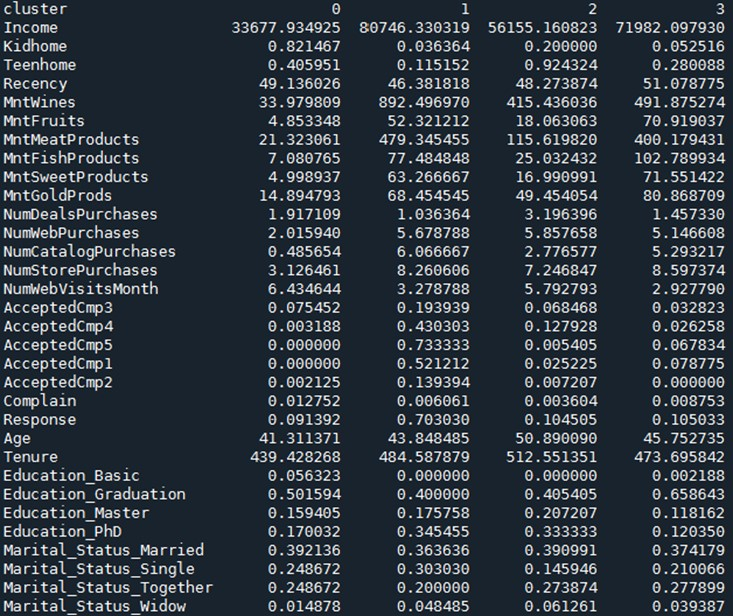
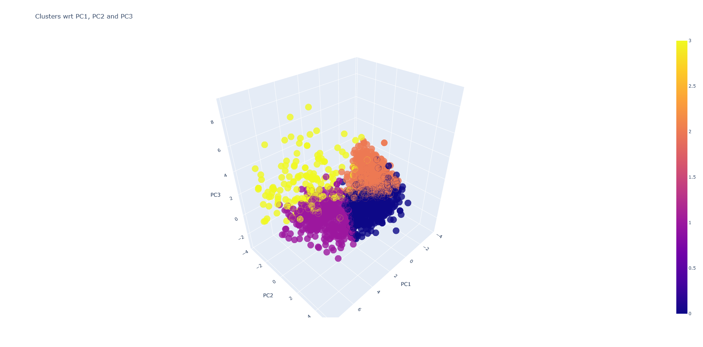

This project employed data mining techniques to segment customers into distinct groups based on their demographic and purchasing behaviour. Data preprocessing and visualization techniques were first used to identify outliers, missing values, and correlations between variables. Principal Component Analysis (PCA) was then applied to reduce the dimensionality of the dataset, followed by K-Means clustering to identify four distinct customer segments. These insights can be leveraged to develop targeted marketing strategies and improve customer satisfaction.

###### Note: This project is created for educational purposes using real data from Kaggle. 

## Data Preprocessing and Visualization
Data Loading: The dataset was loaded into Python using Pandas.
Data Cleaning: Missing values were imputed, and inconsistent data in the Marital_Status column was corrected.
Feature Engineering: New features like Age and Tenure were created, and redundant columns were removed.
Outlier Detection and Removal: Outliers were identified and removed using the IQR method.

Data Visualization: Histograms, scatter plots, and line plots were used to visualize the distributions of variables and their relationships.

## Principal Component Analysis (PCA)
Dimensionality Reduction: PCA was applied to reduce the dimensionality of the dataset to 3 principal components.

Optimal Number of Clusters: The elbow method was used to determine the optimal number of clusters, which was found to be 4.

## K-Means Clustering
Clustering: K-means clustering was applied to the PCA-transformed data to identify 4 distinct customer segments.
Cluster Interpretation: The characteristics of each cluster were analyzed based on their mean values for various variables.

### Customer Segments and Marketing Implications

Segment 1 (Cluster 0): Budget-Conscious Young Families: This segment consists of young families with limited budgets who are highly active on the web. Marketing strategies should focus on value-driven deals and engaging online content.
Segment 2 (Cluster 1): Affluent Lifestyle Seekers: This segment comprises high-income individuals who prefer luxury products and are responsive to campaigns. Marketing strategies should focus on exclusive offers and VIP loyalty programs.
Segment 3 (Cluster 2): Middle-Income Matured Families: This segment consists of middle-income families who are savvy shoppers and value deals. Marketing strategies should focus on family-oriented bundles and deals.
Segment 4 (Cluster 3): Practical Affluent Consumers: This segment comprises high-income individuals who prefer practical products like food and gold. Marketing strategies should focus on high-quality products and targeted campaigns.
Conclusion and Future Directions

The clustering analysis successfully identified four distinct customer segments with unique characteristics. These insights can be leveraged to develop targeted marketing strategies and improve customer satisfaction. Future work could involve exploring other clustering algorithms like hierarchical clustering and experimenting with different variable combinations to uncover additional insights.

##### The full version of this project was submitted as part of an assessment during the course AIB503 - Foundation to Python for AI

