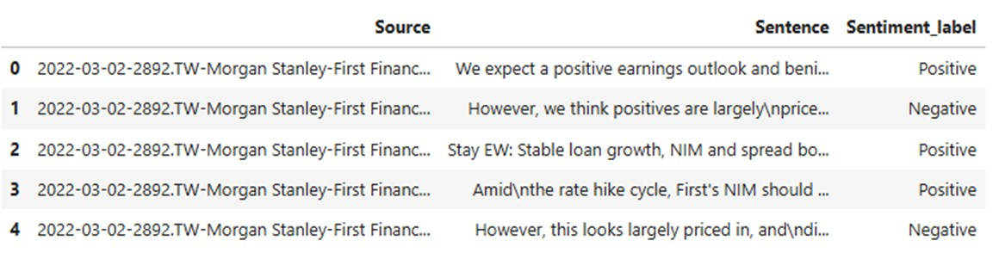
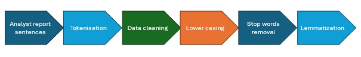
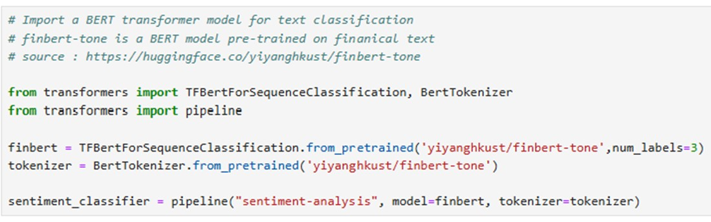
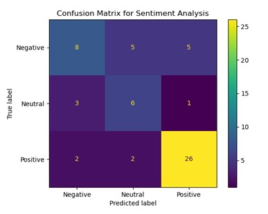
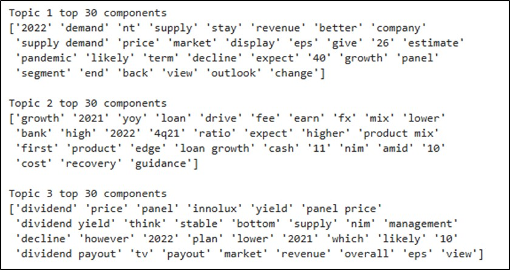
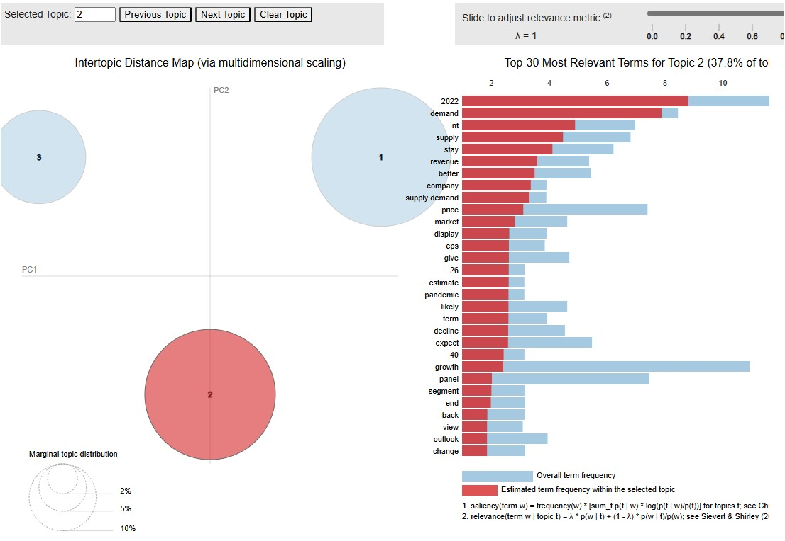

This project employed natural language processing (NLP) techniques to analyse financial analyst reports. By leveraging the pre-trained transformer based FinBERT model, sentiment analysis was conducted, achieving an accuracy of 69%. Additionally, Latent Dirichlet Allocation (LDA) was utilized to identify key topics within the reports, including company fundamentals, dividend yields, and supply-demand dynamics. This project enhanced financial analysis by automating sentiment analysis and topic modelling, ultimately contributing to more informed decision-making.

###### Note: This project is created for educational purposes using real data from several analysts reports.

## Introduction & Problem Statement
The financial industry is awash with data, and the demand for extracting valuable insights from this deluge is ever-growing. In 2023, global spending on financial market data and news reached a staggering $42 billion (Basar, 2024). However, manually sifting through vast amounts of text data to uncover meaningful patterns is a time-consuming and error-prone task.

One powerful technique to extract insights from financial text data is sentiment analysis. By identifying the sentiment expressed in a text, we can gain a deeper understanding of market sentiment, investor behavior, and potential market trends. Financial Sentiment Analysis (FSA) has been shown to significantly improve the performance of stock forecasting models. For instance, Xing, Cambria, and Welsch (2018) demonstrated that incorporating market sentiment into their best forecasting model yielded an impressive annualized return of 45.5%, far surpassing the 10.72% return of a standard ARIMA model.

While most existing FSA solutions focus on social media and news headlines, analyst reports offer a rich source of expert-driven insights. These reports often contain both subjective and objective statements, providing a nuanced perspective on company performance and industry trends. By combining sentiment analysis with topic modeling, we can extract topic-based sentiments, enabling a more granular understanding of the underlying factors driving market sentiment.

## Problem Definition
To address this need, this project aims to develop an NLP solution that automates sentiment analysis and topic modeling of analyst reports. By extracting topic-based sentiments, we can empower financial analysts to make more informed decisions, enhance stock forecasting accuracy, and optimize portfolio management.

## Methodology

#### Data Collection and Preprocessing

Data Source: A dataset of analyst reports in PDF format was used as the primary source of data.
Data Extraction: Sentences were extracted from the first page of each report, where key analysis and insights are typically presented.
Data Labeling: Each sentence was manually labeled as positive, negative, or neutral based on its sentiment.

Data Preprocessing: The text data was cleaned and preprocessed, including tokenization, stop word removal, and lemmatization.

#### Sentiment Analysis

Model Selection: A pre-trained FinBERT model (From HuggingFace transformers library) was chosen for its strong performance on financial sentiment analysis tasks.
Model Implementation: The FinBERT model was used to determine the sentiment of sentences in the prepared dataset as positive, negative or neutral.
Model Evaluation: The model's performance was evaluated using metrics such as accuracy and F1-score.

#### Topic Modeling
Feature Extraction: The preprocessed text data was converted into a bag-of-words representation, incorporating bigrams to capture semantic relationships.
Model Selection: Latent Dirichlet Allocation (LDA) was selected as the topic modeling technique due to its simplicity and effectiveness.
Model Implementation: The LDA model was trained on the feature-engineered data to identify latent topics within the reports.
Topic Interpretation: The identified topics were interpreted by examining the top words associated with each topic.
Results and Discussion

## Sentiment Analysis

The FinBERT model achieved an accuracy of 69% on the given dataset, which is comparable to other studies using similar models.
However, the model struggled with certain challenges, including:
Financial Jargon: The model sometimes misclassified sentences containing domain-specific terms and metaphors.
Quantitative Comparisons: The model had difficulty interpreting and comparing numerical values.

## Topic Modeling
The LDA model successfully identified three main topics within the analyst reports:
- Supply and demand trends (Topic 1)
- Company fundamentals (Topic 2)
- Dividend yields and payouts (Topic 3)

The top 30 words for each topic are seen below: 

Visualisation of topic clusters using PyLDAVis

By combining topic modeling and sentiment analysis, I was able to extract topic-based sentiment insights, providing a more granular understanding of the analyst reports.

## Conclusion and Recommendations
The developed NLP solution demonstrates the potential of automating sentiment analysis and topic modeling for analyst reports. However, there are several areas for improvement:

Advanced Language Models: Exploring more advanced language models, such as ChatGPT-4, can help address the challenges of financial jargon and quantitative comparisons.
Optimized Preprocessing: Refining the text preprocessing pipeline to better handle financial domain-specific language can enhance model performance.
Automated Data Extraction: Developing automated pipelines to extract text from PDF reports and prepare the data for analysis can streamline the process.
By addressing these limitations, we can further refine the solution and provide valuable insights to financial analysts, enabling them to make more informed decisions and improve investment outcomes.

##### The full version of this project was submitted as part of an assessment during the course AIB551 - Natural Language Processing

