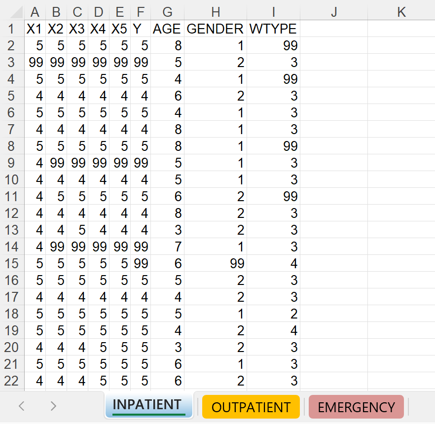
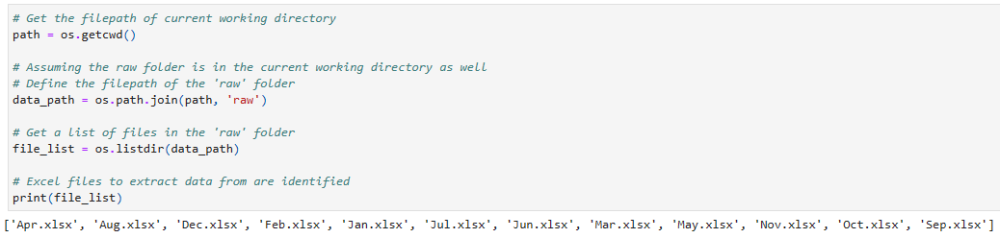
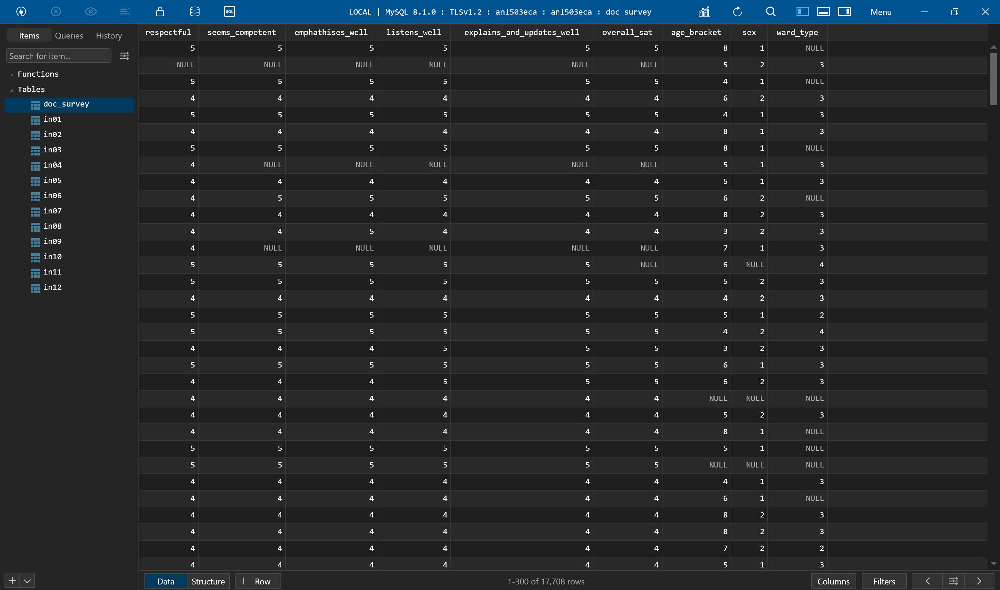

This project involved automating the process of extracting and consolidating data from multiple Excel spreadsheets containing doctor survey responses into a structured MySQL database.

## Requirements

Example of one of the Excel spreadsheets, 'Jan.xlsx'. There is one workbook per month, and the sheet names are inconsistent for each workbook.

Data Source: Excel Workbook
Only data from Excel spreadsheets involving inpatient data labelled "inpatient", "warded", "ip", "in", or "inp" within each Excel document are required.
Each workbook contains data for each month of the year, with workbook file names like "Jan.xlsx,"  "Feb.xlsx,"  etc.

Target: MySQL Tables
Each Excel spreadsheet is to be stored as an individual MySQL table, named according to the month (e.g., "in01" for January). This ensures table names are consistent with the Excel file names, ensuring clear mapping.

## Tools used for the automation process
Python: The program is designed for reusability, allowing adaptation for future reporting cycles with minimal modifications. Extracts data from the identified spreadsheets and loads it into the corresponding MySQL tables.

MySQL: The SQL query constructs the "doc_survey" table by combining data from all twelve monthly tables into a consistent format.

This query performs the following actions:
Combines all records from the twelve tables using "UNION ALL".
Replaces non-valid values (e.g., '99') with NULL values for cleaner data.
Renames columns to meaningful descriptions based on the context of the data.

The final output in MySQL can be seen below.

## Impact of automation
Automated Data Extraction: The Python script developed automatically identifies, extracts, and loads data from relevant spreadsheets into individual MySQL tables. This ensures accuracy and reduces manual effort.

Standardised Data Structure: The script also implemented a consistent naming convention for MySQL tables based on the month of the data, enhancing organisation and clarity.

Data Cleaning & Transformation: The single SQL query to combine data from all monthly tables into a single "doc_survey" table converts non-valid values to NULL and assigns meaningful column names.

Reusability & Adaptability: The Python script was with reusability in mind, allowing for easy adaptation to future changes in file names and spreadsheet labels.

## Conclusion
The automation project effectively integrates data from multiple sources into a structured and consistent MySQL table, facilitating further analysis and reporting. The code created in Python is highly reusable for future reporting cycles and can be adapted to meet changing requirements.

External Links: 
[link:View Python Code](https://waijie-portfolio.streamlit.app/data-consolidation-transformation-with-python)

##### The full version of this project was submitted as part of an assessment during the course ANL503: Data Wrangling.
